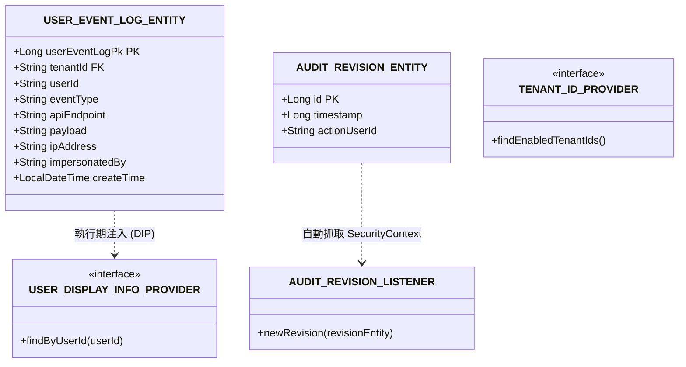
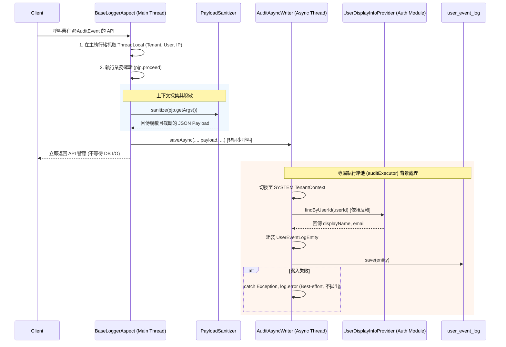
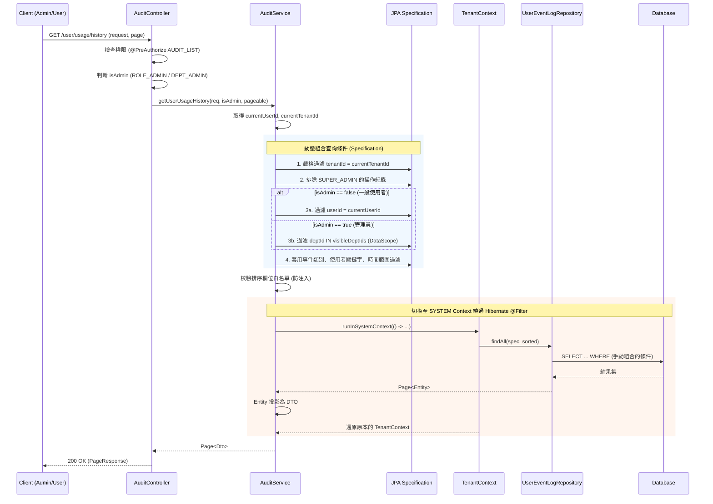

📚 Audit 功能模組技術文件 (Audit Module Architecture & Data Flow)

## 1. 模組概述與架構定位

`Audit` 模組在本系統中同樣具有雙重身分：
*   **業務合規層**：提供平台管理員與一般使用者查詢、過濾、匯出操作歷程與登入紀錄的 API，滿足安全審計與合規追蹤需求。
*   **基礎設施核心**：作為整個系統的可觀測性引擎，提供 AOP 攔截、Spring Event 監聽、Hibernate Envers 資料變更追蹤等底層能力，供所有其他業務模組（如 Tenant, Device, User）**無侵入地**接入審計機制。

---

## 2. 模組全局視圖 (Global View)

### 2.1 核心 Entity 與依賴關聯圖 (ER Diagram)

Audit 模組不僅管理操作日誌，更透過 Hibernate Envers 追蹤實體資料的變更歷史。同時，它透過 Port 介面與其他模組解耦。

### 2.2 審計日誌非同步寫入資料流 (Sequence Diagram)

此流程展示了當業務 API 被呼叫時，Audit 模組如何在不阻塞主執行緒的情況下，安全、完整地採集上下文並落庫。

---

## 3. API 資料流與狀態變化矩陣 (API Data Flow Matrix)

以下為 `AuditController` 提供的查詢與匯出 API 資料流分析。

| API 路徑與方法 | 業務目的 | Input (DTO/Param) | 核心處理邏輯 (Data Transform & Side Effects) | Output (VO) | DB 狀態變化 | 副作用 (Cache/MQ/Audit) |
| :--- | :--- | :--- | :--- | :--- | :--- | :--- |
| `GET /categories` | 取得稽核分類列表 | 無 | 1. 讀取 `AuditCategory` 枚舉值並轉換為字串列表 | `List<String>` | Read (Enum) | 無 |
| `GET /user/usage/history` | 分頁查詢操作歷程 | `AuditQueryRequest`   (條件, 分頁) | 1. 判斷角色 (Admin/User)   2. 組合 JPA Specification (Tenant, DataScope, 排除 SuperAdmin)   3. 切換 SYSTEM Context 執行查詢 | `Page<UserEventLogDto>` | Read (EventLog) | 無 |
| `GET /user/usage/history/export` | 匯出操作歷程 (CSV/XLSX) | `AuditQueryRequest`   `format` (csv/xlsx) | 1. 查詢上限 5000 筆   2. CSV: 注入防護 (prefix `'`)   3. XLSX: `SXSSFWorkbook` 串流寫入防 OOM | File Stream | Read (EventLog) | **Audit: EXPORT_AUDIT**   RateLimit: 5次/60秒 |
| `GET /user/login/my` | 查詢「我的」登入紀錄 | `eventType`, `start/end`, 分頁 | 1. 強制過濾 `userId = currentUserId`   2. 嚴格過濾 `tenantId` (Defense-in-depth) | `Page<UserEventLogDto>` | Read (EventLog) | 無 |

---

## 4. 核心 API 詳細時序圖 (Sequence Diagrams)

針對邏輯最複雜、涉及多層級權限控制的 **查詢操作歷程 (`GET /user/usage/history`)** 進行詳細資料流拆解。此 API 展現了 Audit 模組如何與 Tenant 模組的 DataScope 機制完美整合。

---

## 5. Audit 模組的基礎設施與安全防護網

除了業務 API，Audit 模組還提供了以下隱式但至關重要的架構防護機制，確保審計系統本身的高可用與資安合規：

### 5.1 無侵入採集引擎 (Non-intrusive Collection Engine)
*   **AOP 攔截 (`BaseLoggerAspect`)**：透過 `@Around("@annotation(auditEvent)")` 自動攔截 API，業務程式碼只需加註解即可接入。
*   **Event-Driven 解耦 (`LoginAuditListener`, `VirusScanAuditListener`)**：針對非標準 API 的系統事件（如登入、掃毒），採用 Spring Event 機制。底層模組（如 `common`）只需發布事件，Audit 模組負責訂閱並寫入，實現跨層級的零耦合可觀測性。

### 5.2 非同步與高可用防護 (Async & High Availability Guards)
*   **專屬執行緒池 (`AuditAsyncConfig`)**：配置 `auditExecutor` (Core:2, Max:8, Queue:500)，將日誌 I/O 與 Tomcat 業務執行緒完全隔離。
*   **防丟失拒絕策略 (`CallerRunsPolicy`)**：當佇列滿載時，由**主業務執行緒**親自執行寫入。犧牲該次 API 效能，確保審計日誌**零丟失**。
*   **Best-Effort 容錯**：`AuditAsyncWriter` 內部 `try-catch` 吞掉例外，確保即使資料庫暫時鎖死，也不會導致主業務 API 拋出 500 錯誤。

### 5.3 資安與隱私防護 (Security & Privacy Guards)
*   **Payload 脫敏與截斷 (`PayloadSanitizer`)**：自動遞迴掃描 JSON，將 `password`, `token`, `secret` 替換為 `***`，並強制截斷至 2000 字元，防止機敏資料洩漏與 DB 撐爆。
*   **IP 防偽造**：`BaseLoggerAspect` 直接讀取 TCP 連線的 `req.getRemoteAddr()`，不信任可偽造的 `X-Forwarded-For`，與限流攔截器保持一致策略。
*   **CSV 公式注入防護**：`AuditService.csvEscape()` 會在開頭為 `=, +, -, @` 等危險字元前加上單引號，防止 Excel 公式注入攻擊 (CSV Injection)。

### 5.4 資料生命週期管理 (Data Lifecycle Management)
*   **多租戶個性化清理 (`AuditPurgeJob`)**：每日凌晨 2 點執行。讀取各租戶在 `SystemSetting` 中設定的 `AUDIT_RETENTION_DAYS`，精準刪除過期資料。
*   **髒資料清理**：自動清理 `tenantId` 為 null 的孤立紀錄，並具備 `NumberFormatException` 容錯降級機制。

### 5.5 資料變更追蹤 (Data-level Auditing)
*   **Hibernate Envers 整合**：透過 `AuditRevisionEntity` 與 `AuditRevisionListener`，在 JPA Entity 發生 CRUD 時，自動記錄版本號與 `actionUserId`，實現資料列級別的歷史回溯（Who changed What and When）。

---

## 6. 總結：模組耦合度分析

Audit 模組透過嚴格的架構設計，實現了極佳的低耦合與高內聚：

1.  **依賴反轉 (DIP) 打破分層限制**：`audit` (L1) 需要使用者顯示資訊，但為了不直接依賴 `auth/user` (L2) 造成循環依賴，它依賴了定義在 `common` (L0) 的 `UserDisplayInfoProvider` 介面。具體實作由 L2 提供，完美遵守了分層架構原則。
2.  **Event-Driven 實現跨模組可觀測性**：`common` 模組在進行檔案掃毒時，只需發布 `VirusScanAuditEvent`，完全不需要 `import` 任何 Audit 模組的類別。Audit 模組在 L1 層訂閱並處理，實現了「發布者不知道訂閱者是誰」的極致解耦。
3.  **封裝多租戶複雜度**：查詢 API 內部自動處理 `TenantContext` 切換、DataScope 部門權限過濾、SuperAdmin 紀錄排除。上層前端或呼叫端只需傳遞標準的 `AuditQueryRequest`，無需關心底層複雜的資料隔離邏輯。

這套設計將「審計採集的複雜度」與「資料隔離的嚴謹性」完美封裝在 Audit 模組內部，為上層業務開發提供了極致簡潔、安全且高效的審計接入體驗。