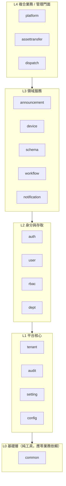
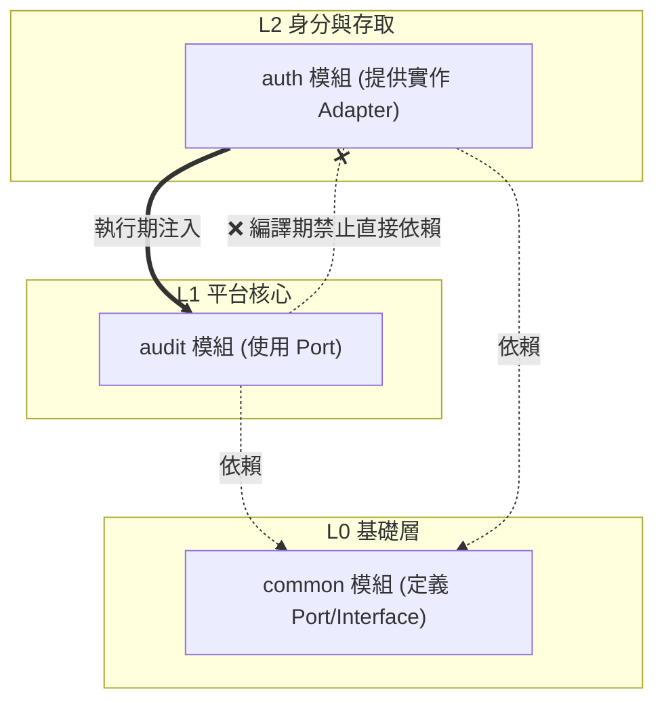

L1（audit)的模組是否可以使用L2(auth)？

根據您提供的架構圖以及我們前面討論的程式碼，答案是：**不可以「直接」依賴（import L2 的類別），但可以透過「依賴反轉（DIP）」來「間接」使用。**

以下為您詳細解析為什麼這樣設計，以及系統是如何運作的：

### 1. 從架構圖來看：嚴格的單向依賴原則
根據您的 Mermaid 圖，依賴方向是 `L4 -> L3 -> L2 -> L1 -> L0`。這代表**上層可以依賴下層，但下層絕對不能依賴上層**。
*   `audit` 屬於 **L1（平台核心）**。
*   `auth` 屬於 **L2（身分與存取）**。

如果 `audit` (L1) 直接 `import` 並使用了 `auth` (L2) 的類別，就會造成**下層依賴上層**，這會破壞分層架構。更嚴重的是，這極易引發**循環依賴（Circular Dependency）**：
*   *假設情境*：`auth` 模組在處理「使用者登入」時，需要呼叫 `audit` 寫入登入日誌（L2 依賴 L1）。如果此時 `audit` 又直接依賴 `auth` 去查詢使用者資訊（L1 依賴 L2），Spring 在啟動時就會因為找不到誰該先初始化而直接崩潰。

### 2. 從程式碼來看：如何「間接」使用？（依賴反轉）
為了讓 L1 (`audit`) 能拿到 L2 (`auth`) 的使用者資訊，同時又不違反架構原則，系統採用了我們前面討論過的 **Port-Adapter（埠-適配器）模式**：

1.  **定義 Port（在 L0）**：`audit` 模組在 **L0 (`common`)** 中定義了一個介面 `UserDisplayInfoProvider`。
2.  **依賴抽象（在 L1）**：`audit` 模組的 `AuditAsyncWriter` 只依賴這個 L0 的介面，**完全不 import 任何 L2 (`auth`) 的類別**。
3.  **提供實作（在 L2）**：`auth` 模組（上層）去實作這個 L0 的介面（提供具體的資料庫查詢邏輯）。
4.  **執行期注入**：Spring 容器在啟動時，會把 L2 實作出來的物件，注入給 L1 使用。

### 3. 依賴關係的視覺化（符合您的架構圖）

### 總結
在您的架構設計中，**L1 (`audit`) 在編譯期（程式碼層級）是絕對不能使用 L2 (`auth`) 的**。

但是，透過將介面定義在 **L0 (`common`)**，`audit` 可以在**執行期**安全地獲取 `auth` 提供的能力。這種設計完美地遵守了您的分層架構圖，既解決了業務需求（審計日誌需要顯示使用者名稱），又保持了模組間的極致解耦與架構的純潔性。