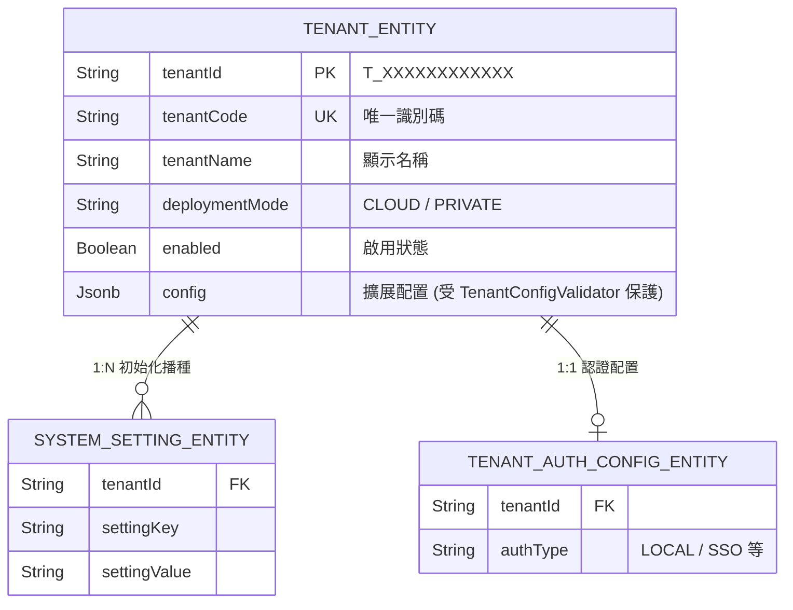
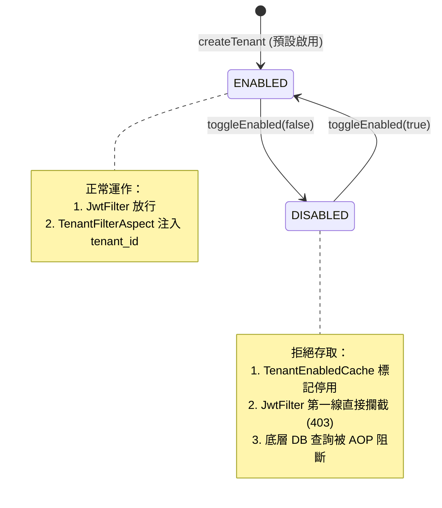
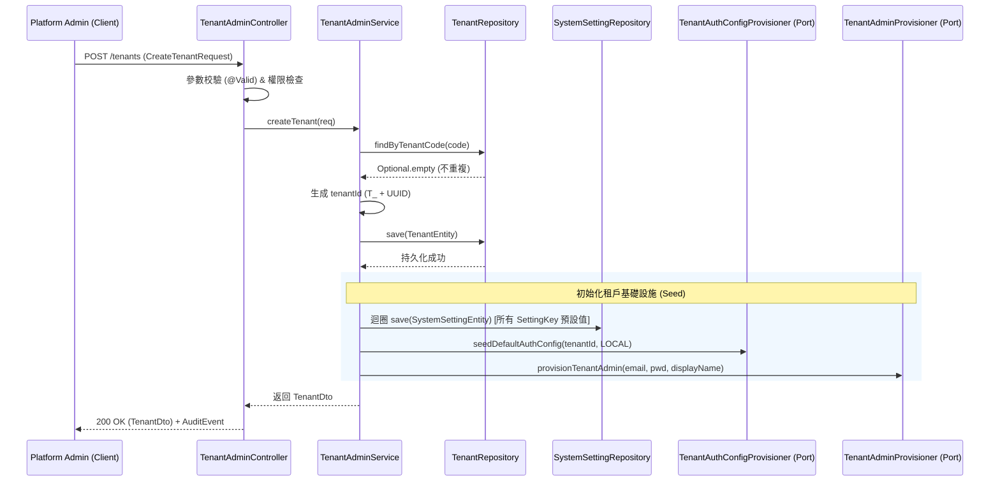
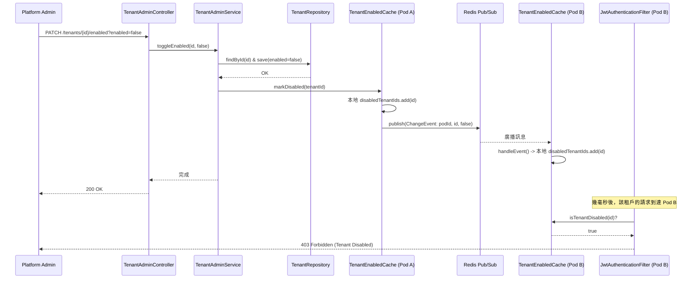

# 📚 Tenant 功能模組技術文件 (Tenant Module Architecture & Data Flow)

## 1. 模組概述與架構定位
`Tenant` 模組在本系統中具有**雙重身分**：
1. **業務管理層**：提供平台超級管理員（Super Admin）對租戶生命週期（建立、編輯、啟用/停用）的管理 API。
2. **基礎設施核心**：作為整個 SaaS 多租戶架構的引擎，提供 `TenantContext`、Hibernate Filter 注入、跨實例快取同步等底層隔離能力，供所有其他業務模組（如 Order, Device）依賴。

---

## 2. 模組全局視圖 (Global View)

### 2.1 核心 Entity 關聯圖 (ER Diagram)
Tenant 模組不僅管理租戶本身，還負責在建立租戶時「播種 (Seed)」該租戶的初始系統設定與認證配置。

### 2.2 租戶狀態流轉圖 (State Diagram)
租戶的核心狀態變化集中在 `enabled` 欄位，其切換會直接觸發底層快取與 JWT 攔截器的連鎖反應。

---

## 3. API 資料流與狀態變化矩陣 (API Data Flow Matrix)

以下為 `TenantAdminController` 提供的平台級管理 API 資料流分析。這些 API 均受 `@PreAuthorize("hasAuthority('PLATFORM_TENANT_MANAGE')")` 保護。

| API 路徑與方法 | 業務目的 | Input (DTO/Param) | 核心處理邏輯 (Data Transform & Side Effects) | Output (VO) | DB 狀態變化 (CUD) | 副作用 (Cache/MQ/Audit) |
| :--- | :--- | :--- | :--- | :--- | :--- | :--- |
| `GET /v1/platform/tenants` | 列出所有租戶 | 無 | 1. 查詢所有 TenantEntity (依建立時間倒序) 2. Entity 投影為 DTO | `List<TenantDto>` | **Read** (Tenant) | 無 |
| `POST /v1/platform/tenants` | **建立新租戶** (核心) | `CreateTenantRequest` (code, name, mode, adminEmail, adminPwd) | 1. 檢查 `tenantCode` 唯一性 2. 生成 `T_` 開頭的 UUID tenantId 3. 儲存 TenantEntity 4. **Seed** 預設 SystemSettings 5. **Seed** 預設 AuthConfig 6. 呼叫 Port 建立初始管理員帳號 | `TenantDto` | **Create** (Tenant, SystemSettings, AuthConfig, Admin User) | **Audit**: `CREATE_TENANT` **RateLimit**: 10次/分 |
| `PUT /{tenantId}` | 編輯租戶基本資料 | Path: `tenantId` Body: `UpdateTenantRequest` (name, mode) | 1. 查詢 TenantEntity (不存在拋 404) 2. 更新 name 與 deploymentMode 3. 儲存並返回 DTO | `TenantDto` | **Update** (Tenant: name, mode) | **Audit**: `UPDATE_TENANT` **RateLimit**: 30次/分 |
| `PATCH /{tenantId}/enabled` | **切換啟用狀態** (高風險) | Path: `tenantId` Param: `enabled` (bool) | 1. 查詢 TenantEntity 2. 更新 `enabled` 欄位並儲存 3. **觸發快取失效**：呼叫 `TenantEnabledCache.markEnabled/Disabled` | `Void` (200 OK) | **Update** (Tenant: enabled) | **Cache**: 更新本機 ConcurrentHashMap **Redis Pub/Sub**: 廣播 `ChangeEvent` 至所有 Pod **Audit**: `TOGGLE_TENANT_ENABLED` |

---

## 4. 核心 API 詳細時序圖 (Sequence Diagrams)

針對邏輯最複雜、副作用最多的兩個核心 API 進行詳細資料流拆解。

### 4.1 建立新租戶 (POST /v1/platform/tenants)
此 API 展現了 Tenant 模組作為「基礎設施」的職責：不僅建立租戶本身，還負責初始化該租戶運行所需的底層配置（Settings, Auth, Admin）。

### 4.2 切換租戶啟用狀態 (PATCH /{tenantId}/enabled)
此 API 是**多實例分散式架構下的關鍵節點**。停用租戶不能只改 DB，必須確保所有 Pod 的 JWT 攔截器能「秒級」拒絕該租戶的請求。

---

## 5. Tenant 模組的基礎設施與安全防護網

除了上述的業務 API，Tenant 模組還提供了以下**隱式但至關重要**的架構防護機制（這些機制保護著 Tenant 本身，也保護著系統中的其他模組）：

### 5.1 資料隔離引擎 (Isolation Engine)
*   **`package-info.java`**：全域宣告 Hibernate `@FilterDef(name="tenantFilter")`。
*   **`TenantFilterAspect`**：在每次 Repository 呼叫前，自動從 `TenantContext` 讀取 `tenantId` 並注入 Hibernate Filter。**Fail-closed 設計**：若無 Context 直接拋錯，防止資料外洩。
*   **`TenantSystemContextAspect`**：提供 `@RunInSystemTenantContext` 註解，讓排程任務或超管操作能安全地「跨越租戶邊界」，並透過 Phase B 檢查確保只有 Trusted 來源或 SUPER_ADMIN 才能使用。

### 5.2 啟動期與執行期的結構性防護 (Structural Guards)
*   **`TenantConsistencyValidator` (T-8)**：啟動時掃描 JPA Metamodel，確保所有 `TenantAware` Entity 的 Repository 都有實作 `TenantScopedRepository`。若開發者遺漏，**直接中止應用啟動 (Fail-fast)**，從根源杜絕資料外洩。
*   **`TenantConfigValidator` (T-9)**：防護 `TenantEntity.config` (JSONB) 欄位。限制大小 (10KB)、Top-level keys (50個)、巢狀深度 (5層)，防止未來開放 API 時遭遇 NoSQL 注入或 OOM 攻擊。

### 5.3 分散式快取與一致性 (Distributed Cache)
*   **`TenantEnabledCache`**：結合 **Local Cache (ConcurrentHashMap) + Redis Pub/Sub + 定期排程校正**。解決了多 Pod 環境下，停用租戶狀態同步的延遲問題，同時具備 Redis 斷線時的優雅降級 (LOCAL-ONLY) 能力。

### 5.4 部署形態適配 (Deployment Adaptation)
*   **`TenantProperties` & `TenantInterceptor`**：透過 `tenant.mode=single/multi` 配置，讓同一套程式碼能無縫切換於「SaaS 多租戶」與「單一客戶私有化部署」之間。Interceptor 包含 **T-5 安全防護**，防止私有化部署時誤用多租戶 JWT 導致的資料污染。

---

## 6. 總結：模組耦合度分析

正如我們之前討論的，Tenant 模組透過上述設計，實現了極佳的**低耦合**：
1. **業務模組（如 Order）完全不需要知道 Tenant 的存在**，只需乖乖實作 `TenantScopedRepository`，底層 AOP 會自動處理隔離。
2. **Tenant 模組自身**則透過 `TenantIdProvider` 介面（依賴反轉），讓其他需要跨租戶操作的模組（如全局排程）只需依賴 `common` 層的介面，而不依賴 Tenant 的 Repository 實作。

這套設計將「多租戶的複雜度」完美封裝在 Tenant 模組與底層 AOP 中，為上層業務開發提供了極致簡潔且安全的開發體驗。