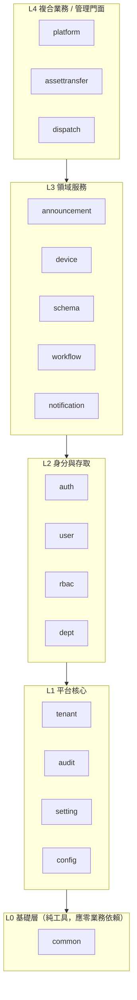

# 模組劃分合理性評估報告

> 對象：`com.taipei.iot` 後端 17 個功能模組
> 方法：以**靜態 import 分析**統計跨模組依賴次數，建立依賴矩陣，找出循環依賴與分層違規，再對照「依領域職責劃分」的合理性。
> 立場：呼應 [02-feature/README.md](../02-feature/README.md) 的原則——**追求合理的邊界與低耦合，但警惕過度設計**；本報告只建議「已被證據支持」的調整，不主張為了漂亮而拆分。

---

## 0. 一句話結論

> **「模組怎麼切」（依業務領域劃分 17 個模組）本身合理、顆粒度恰當；真正需要整治的是「模組之間怎麼連」——目前存在 1 處分層違規（`common` 反向依賴業務模組）與多組循環依賴，核心糾結在 `auth ↔ tenant ↔ audit ↔ user ↔ setting` 這個平台底層叢集。**
> 建議的調整都是「低風險重構」（搬移少數檔案、把跨切面改成事件驅動、釐清 `user`/`auth` 的資料歸屬），而非重新劃分模組。

---

## 1. 跨模組依賴矩陣（實測）

數字 = 該列模組 import 該欄模組的次數（越大耦合越深）。`common`/`config` 等被省略欄位以節省篇幅，完整列在文字版下方。

| 模組＼依賴 | common | tenant | auth | audit | workflow | dept | user | setting | notification | device | 其他 |
|---|---|---|---|---|---|---|---|---|---|---|---|
| **announcement** | 24 | 7 | 2 | 2 | – | 5 | – | – | – | – | |
| **assettransfer** | 4 | 4 | 1 | 2 | **13** | 1 | – | – | – | – | |
| **audit** | 13 | 9 | 3 | – | – | 0 | 0 | 2 | – | – | dept/user 已歸零（2G） |
| **auth** | 48 | 11 | – | 9 | – | – | 3 | – | – | – | config 1 |
| **common** | – | **1** | – | – | **6** | **1** | – | – | – | – | ⚠️ 見 §3 |
| **config** | 7 | 1 | 0 | – | – | – | – | – | – | – | auth 已歸零（2G，SecurityConfig 移入 auth） |
| **dept** | 8 | 4 | 3 | 2 | – | – | 0 | – | – | – | user 已歸零（2F） |
| **device** | 12 | 18 | – | 6 | – | 0 | – | – | – | – | schema 1（dispatch 已歸零） |
| **dispatch** | 5 | 7 | 2 | – | 5 | – | – | – | – | 2 | |
| **notification** | 9 | 7 | 3 | 2 | – | – | – | 2 | – | – | config 1 |
| **platform** | 13 | 3 | 7 | 4 | – | – | – | – | 4 | – | rbac 1 / announcement 1 |
| **rbac** | 11 | 2 | 2 | 4 | – | 1 | – | – | – | – | |
| **schema** | 3 | 3 | – | – | – | – | – | – | – | 1 | |
| **setting** | 5 | 4 | – | 2 | – | – | – | – | – | – | |
| **tenant** | 8 | – | **0** | 2 | – | – | **0** | 3 | – | – | |
| **user** | 16 | 6 | **0** | – | – | 2 | – | – | – | – | rbac 1 |
| **workflow** | 2 | 14 | 4 | – | – | – | – | – | 4 | – | |

---

## 2. 自然分層（理想形）vs 現況

依「被依賴程度」與「職責」，模組可分為以下五層。理想上**依賴只能由上往下單向流動**：

**符合分層的好例子（劃分正確的證據）**：
- `assettransfer`(13)、`dispatch`(5) 依賴 `workflow`，而 `workflow` **不**反向依賴它們 → 流程引擎被乾淨地重用，正是「易擴展」想要的單向依賴。
- `platform` 作為管理門面，依賴 `auth/notification/audit/announcement`，本身不被業務模組依賴 → 門面層定位正確。

> 這說明**領域切分的思路是對的**；問題出在下面幾條「逆流」與「環流」。

---

## 3. 問題一：`common` 不是純基礎層（分層違規）⚠️ 高優先 ✅ 已修

L0 的 `common` 應該**只被依賴、不依賴任何業務模組**，但實測它反向依賴了三個上層模組。以下為修法與現況：

| 違規檔案 | 反向依賴 | 修法 | 狀態 |
|---|---|---|---|
| [common/exception/GlobalExceptionHandler.java](../../backend/src/main/java/com/taipei/iot/common/exception/GlobalExceptionHandler.java) | → `workflow.exception.*`（6 個例外） | 將 workflow 專屬例外處理**遷移至 workflow 自帶的** `WorkflowExceptionHandler`（`@RestControllerAdvice`），原有 import 與 handler 從 `GlobalExceptionHandler` 移除 | ✅ |
| [common/util/TenantAwareQuery.java](../../backend/src/main/java/com/taipei/iot/common/util/TenantAwareQuery.java) | → `tenant.TenantContext` | 將 `TenantContext`（純 ThreadLocal 基礎設施）**下沉到** [`common.context`](../../backend/src/main/java/com/taipei/iot/common/context/TenantContext.java)；舊 `tenant.TenantContext` 保留為 `@Deprecated` 委派類別供暫存相容 | ✅ |
| [common/util/DataScopePredicates.java](../../backend/src/main/java/com/taipei/iot/common/util/DataScopePredicates.java) | → `dept.enums.DataScopeEnum` | 將 `DataScopeEnum` **下沉到** [`common.enums`](../../backend/src/main/java/com/taipei/iot/common/enums/DataScopeEnum.java)；舊 `dept.enums.DataScopeEnum` 保留為 `@Deprecated` | ✅ |

> **根因**：`TenantContext`、`DataScopeEnum` 是**跨模組共用的「核心概念（shared kernel）」**，不該放在業務模組。修法將它們歸位到基礎層，同時保留 `@Deprecated` 舊類別確保 Transient 期的向後相容。
>
> **影響範圍**：`TenantContext` import 更新 24 個檔案、`DataScopeEnum` import 更新 6 個檔案、新增 3 個檔案（`common.context.TenantContext`、`common.enums.DataScopeEnum`、`workflow.exception.WorkflowExceptionHandler`），全為純 import 搬移，無行為變更。

---

## 4. 問題二：平台底層的循環依賴叢集 ✅ 2B+2C 已修（平台底層叢集全斷）

實測存在多組**雙向**依賴（A 依賴 B 且 B 依賴 A），集中在平台底層。下表「次數」欄左為實測初值、括號為修後值：

| 循環 | 次數（修後） | 性質 | 狀態 |
|---|---|---|---|
| `tenant` ↔ `setting` | 3 / 4 → **(0 / 3)** | 租戶讀設定；設定綁租戶 | ✅ **2A 已斷**（setting→tenant 歸零） |
| `auth` ↔ `config` | 1 / 3 → **(0 / 3)** | 安全設定 | ✅ **2A 已斷**（auth→config 歸零） |
| `auth` ↔ `tenant` | 11 / 8 → (4 / 8) → **(2 / 0)** | 登入要租戶上下文；租戶操作要認證 | ✅ **2C 已斷**（`tenant→auth` 歸零；`auth→tenant` 為合法 L2→L1） |
| `tenant` ↔ `audit` | 2 / 9 → **(2 / 5) → (0 / 0)** | 稽核查租戶名 | ✅ **2B 已斷** |
| `auth` ↔ `audit` | 9 / 3 → **(0 / 1†)** | 登入要寫稽核；稽核要查使用者 | ✅ **2B 已斷**（†見下） |
| `auth` ↔ `user` | 3 / 16 → **(0 / 7)** | 見問題三 | ✅ **Plan A 已修** |
| `tenant` ↔ `user` | 1 / 6 → **(0 / 2)** | 使用者—租戶映射 | ✅ **2C 已斷**（`tenant→user` 歸零；`user→tenant` 為合法 L2→L1） |
| `device` ↔ `dispatch` | 2 / 2 → **(0 / 1)** | 工單關聯裝置；裝置反向引用 | ✅ **2E 已斷**（`device→dispatch` 歸零；`dispatch→device` 為合法消費方向） |
| `device` ↔ `schema` | 1 / 1 → **(1 / 0)** | 裝置驗證屬性 vs 模板定義 | ✅ **2D 已斷**（`schema→device` 歸零；`device→schema` 為合法消費方向） |
| `dept` ↔ `user` | 3 / 1 → **(0 / 1)** | 刪部門需查/清使用者；使用者隸屬部門 | ✅ **2F 已斷**（`dept→user` 歸零；`user→dept` 為合法方向） |

> † `AuditService` 仍有 1 個 `auth.entity.UserEntity` import（JPA Criteria 子查詢排除 SUPER_ADMIN）。由於 `auth → audit = 0`，**不構成雙向環**，僅為單向依賴，可接受。

### 🔧 2A 修法與狀態（已完成）

把**純橫切基礎設施型別下沉到 L0 `common`**，不動業務語意：

| 動作 | 內容 | 影響 |
|---|---|---|
| 下沉 tenant kernel | `TenantAware`、`TenantScopedRepository`、`TenantEntityListener`、`RunInSystemTenantContext` → `common.tenant` | 44 個 import 檔改寫；`setting→tenant` 歸零 → **斷 tenant↔setting** |
| 下沉 CorsProperties | `config.CorsProperties` → `common.config.CorsProperties` | `auth→config` 歸零 → **斷 config↔auth** |
| 保留於 tenant | `TenantEntity`、`TenantRepository`、`TenantEnabledCache`（真業務型別） | — |

> **驗證**：grep 全專案（main + test）已無舊 FQN 殘留。`mvn spring-javaformat:apply` 已執行。

### 🔧 2B 修法與狀態（已完成）

四個子任務，各自獨立，不動業務邏輯：

| 子任務 | 手段 | 新增/移動檔案 | 斷開的環 |
|---|---|---|---|
| **2B-1** 下沉 audit kernel | `@AuditEvent`、`AuditEventType`、`AuditCategory` → `common.audit.*` | 3 個新 common 檔；原 3 個刪除；~25 個 import 改寫 | `tenant→audit`（2→0），`auth→audit` 減 7 |
| **2B-2** `LoginAuditEvent` 事件化 | `auth` 改用 `ApplicationEventPublisher.publishEvent(LoginAuditEvent)` 取代直接操作 `UserEventLogRepository`；新增 `LoginAuditListener` 訂閱 | `common/event/LoginAuditEvent.java`；`audit/listener/LoginAuditListener.java` | `auth→audit`（剩餘 2→0） |
| **2B-3** `UserDisplayInfoProvider` 埠 | `audit.AuditAsyncWriter` 改用 `UserDisplayInfoProvider`（common）取代 `UserRepository`（auth）；auth 提供 `AuthUserDisplayInfoProvider` 實作 | `common/audit/port/UserDisplayInfo.java`；`…/UserDisplayInfoProvider.java`；`auth/provider/audit/AuthUserDisplayInfoProvider.java` | `audit→auth`（AuditAsyncWriter 的 2→0） |
| **2B-4** `TenantIdProvider` 埠 | `audit.AuditPurgeJob` 改用 `TenantIdProvider`（common）取代 `TenantRepository`（tenant）；tenant 提供 `TenantIdProviderImpl` 實作 | `common/tenant/TenantIdProvider.java`；`tenant/TenantIdProviderImpl.java` | `audit→tenant`（2→0） |

**剩餘解耦手段（都不需重劃模組）：**

### 🔧 2C 修法與狀態（已完成）— 反轉 `TenantAdminService` 的向上佈建依賴

`auth↔tenant` 與 `tenant↔user` 兩環的**唯一共同元兇**是 `TenantAdminService.createTenant()`：它位於 L1（tenant）卻向上呼叫 L2 的 `user`／`auth` 來佈建初始管理員與 auth config。以 **Port/Adapter 依賴反轉**收斂：

| 子任務 | 手段 | 新增檔案 | 斷開的環 |
|---|---|---|---|
| **2C-1** 管理員佈建埠 | `TenantAdminService` 改用 `TenantAdminProvisioner`（common）取代直接操作 `UserRepository`/`UserTenantMappingRepository`/`PasswordValidator`；user 提供 `UserProvisioningAdapter` 實作 | `common/user/port/TenantAdminProvisioner.java`；`user/service/UserProvisioningAdapter.java` | `tenant→user`（1→0） |
| **2C-2** auth config 佈建埠 | `TenantAdminService` 改用 `TenantAuthConfigProvisioner`（common）取代直接操作 `TenantAuthConfigRepository`；auth 提供 `TenantAuthConfigProvisionerAdapter` 實作 | `common/auth/port/TenantAuthConfigProvisioner.java`；`auth/provider/config/TenantAuthConfigProvisionerAdapter.java` | `tenant→auth`（2→0） |

> **保留**：`auth→tenant`（2：`TenantEntity`/`TenantRepository`/`TenantEnabledCache`）與 `user→tenant`（2：`TenantEntity`/`TenantRepository`）皆為 **L2→L1 合法向下依賴**，不構成環。
>
> **驗證**：`tenant→user`、`tenant→auth` import 皆歸零；`TenantAdminServiceTest`（8）、`UserProvisioningAdapterTest`（5）綠燈；`LayeredArchitectureTest` 3 項通過。至此**問題二平台底層叢集（auth/tenant/audit/user/setting/config）7 環全斷**，僅餘問題四的 `device↔dispatch` 小環。

### 🔧 2D 修法與狀態（已完成）— 斷 `device ↔ schema`，確立 schema 為定義層

**領域模型校正**：`schema`（device template）是**裝置型別的定義／藍圖**，被 `device`（驗證屬性）、未來的 `telemetry`（驗證格式）、`event-rule`（依 schema 設定規則）**多方單向消費**。故 `schema` 應維持為獨立的**定義層**（非如舊版建議併入 `device`），正確方向是 `device → schema`。

唯一的反向依賴在 `DeviceTemplateService.deleteDeviceType()` 的「使用中防護」（刪除模板前確認無裝置使用）。以 Port/Adapter 反轉：

| 子任務 | 手段 | 新增檔案 | 斷開的環 |
|---|---|---|---|
| **2D-1** 裝置型別使用量埠 | `DeviceTemplateService` 改用 `DeviceTypeUsageGuard`（common）取代直接操作 `DeviceRepository`；device 提供 `DeviceTypeUsageAdapter` 實作 | `common/device/port/DeviceTypeUsageGuard.java`；`device/service/DeviceTypeUsageAdapter.java` | `schema→device`（1→0） |

> **保留**：`device→schema`（1：`DeviceTemplateService` 驗證屬性）為消費者→定義的合法方向。
>
> **驗證**：`schema→device` import 歸零；`LayeredArchitectureTest` 3 項通過。僅餘 `device↔dispatch` 一個小環。

### 🔧 2E 修法與狀態（已完成）— 斷 `device ↔ dispatch`

唯一的反向依賴在 `DeviceService.getStats()` 的 `openFaults` 統計，原本直接呼叫 `WorkOrderRepository.countOpenWorkOrders` 並使用 `dispatch` 的 `WorkOrderStatus` enum。以 Port/Adapter 反轉：

| 子任務 | 手段 | 新增檔案 | 斷開的環 |
|---|---|---|---|
| **2E-1** 未結工單計數埠 | `DeviceService` 改用 `OpenWorkOrderCounter`（common）取代直接操作 `WorkOrderRepository`；「open」語意與狀態集合由 dispatch 擁有，dispatch 提供 `OpenWorkOrderCounterAdapter` 實作 | `common/dispatch/port/OpenWorkOrderCounter.java`；`dispatch/service/OpenWorkOrderCounterAdapter.java` | `device→dispatch`（2→0） |

> **保留**：`dispatch→device`（1）為工單關聯裝置的合法消費方向。
>
> **驗證**：`device→dispatch` import 歸零；`LayeredArchitectureTest` 3 項通過，凍結庫自動清除已解決的 `device↔schema`、`device↔dispatch` 環。**至此問題二、問題四所有循環全斷**，僅餘 `dept↔user`（L2↔L2，獨立議題）一環凍結追蹤中。

### 🔧 2F 修法與狀態（已完成）— 斷 `dept ↔ user`（L2↔L2 最後一環）

`dept` 與 `user` 同屬 L2，但 `DeptService.deleteDept()` 直接持有 `UserRepository`/`UserTenantMappingRepository`：刪除部門前需（1）查在職成員作刪除防護、（2）清除 `user_tenant_mapping.dept_id` 外鍵引用。自然方向是 `user → dept`（使用者隸屬部門），故以 Port/Adapter 反轉 `dept → user`：

| 子任務 | 手段 | 新增檔案 | 斷開的環 |
|---|---|---|---|
| **2F-1** 部門成員埠 | `DeptService` 改用 `DeptMembershipGuard`（common）取代直接操作 user 儲存庫；user 提供 `DeptMembershipAdapter` 實作（含「過濾已刪除使用者」邏輯） | `common/user/port/DeptMembershipGuard.java`；`user/service/DeptMembershipAdapter.java` | `dept→user`（3→0） |

> **保留**：`user→dept`（1：`UserAdminService` 用 `DataScopeHelper`/`DeptInfoRepository` 做資料範圍過濾）為使用者→所屬部門的合法方向。
>
> **驗證**：`dept→user` import 歸零；`DeptServiceTest`（16）、`DeptMembershipAdapterTest`（4）綠燈。**所有模組層級循環全部消除**，`no_cyclic_dependencies` 已從 `FreezingArchRule` **升級為嚴格規則**（移除凍結）。

---

### 🔧 2G 修法與狀態（已完成）— 收尾最後兩處分層違規（升 `layers_are_respected` 為嚴格）

剩餘兩處由下層反向依賴上層的分層違規：`audit`（L1）→ `dept`/`user`（L2），以及 `config`（L1）→ `auth`（L2）。全部以 Port/Adapter 反轉或搬遷模組落腳處解決：

| 子任務 | 違規 | 手段 | 新增/異動檔案 | 結果 |
|---|---|---|---|---|
| **2G-1** 可見部門範圍埠 | `audit→dept` | `AuditService.getUserUsageHistory()` 的 Specification 改用 `VisibleDeptScopeProvider`（common）取代 `DataScopeHelper`；dept 提供 `VisibleDeptScopeAdapter` | `common/dept/port/VisibleDeptScopeProvider.java`；`dept/service/VisibleDeptScopeAdapter.java` | `audit→dept`（1→0） |
| **2G-2** 超管名錄埠 | `audit→user` | 以 `SuperAdminDirectory`（common）回傳超管 userId 清單取代對 `UserEntity` 的 JPA Criteria 關聯子查詢；user 提供 `SuperAdminDirectoryAdapter`（`UserRepository.findSuperAdminUserIds()`） | `common/user/port/SuperAdminDirectory.java`；`user/service/SuperAdminDirectoryAdapter.java`；`UserRepository` 加 `findSuperAdminUserIds()` | `audit→user`（→0） |
| **2G-3** SecurityConfig 歸位 | `config→auth` | `SecurityConfig` 注入 `auth.security` 三個過濾器，自然屬於 auth 模組；以 `git mv` 由 `config` 搬到 `auth/config`，更新 package 與所有 `@WebMvcTest` `@Import` 引用 | `config/SecurityConfig.java` → `auth/config/SecurityConfig.java`（含 ~14 個測試引用更新） | `config→auth`（3→0） |

> **驗證**：`audit→dept`/`audit→user`/`config→auth` import 全數歸零。**所有分層違規清零**，`layers_are_respected` 已從 `FreezingArchRule` **升級為嚴格規則**（移除凍結）。至此 `LayeredArchitectureTest` 三條規則（分層、`common` 無業務依賴、無循環）**全部為嚴格規則、無任何凍結**，`backend/archunit_store/` 與 `archunit.properties` 已移除。`LayeredArchitectureTest` 3 項通過；`AuditServiceTest`（19）、相關 `@WebMvcTest`（AuthController/DeptController/UserAdmin/UserSelf/AuditController/SecurityConfigCsp 等）綠燈。
>
> ⚠️ **既有紅燈（非本次造成）**：全量 `mvn test` 另有 5 個測試類別失敗（`AuthServiceTest`、`UserAdminServiceTest`、`TenantAdminServiceSeedSettingsTest`、`AuditPurgeJobTest`、`AuditAsyncWriterTest`），症狀為 `@InjectMocks` 注入埠（`eventPublisher`/`passwordPolicyResolver`/`tenantAuthConfigProvisioner`/`tenantIdProvider`）為 null。這些檔案未被本次（2G）改動（`git diff HEAD` 為空），屬先前重構未同步更新對應測試的遺留問題，需另案處理。

---

## 5. 問題三：`user` 與 `auth` 的邊界模糊（資料歸屬倒置） ✅ Plan A 已修

- `user` → `auth` 高達 **16** 次→**0**，`auth` → `user` 仍有 7 次（單向正確）。
- 根因：**使用者的資料實體放在 `auth`**（`auth/entity/UserEntity.java`、`auth/repository/UserRepository.java`），但「使用者管理」職責在 `user` 模組 → `user` 被迫大量反向 import `auth` 的實體/儲存庫。

### 🔧 Plan A 修法與狀態（已完成）

採用**方案 A**（釐清歸屬），將身分資料實體從 `auth` 搬到正確模組，`auth` 僅保留認證行為：

| 動作 | 內容 | 影響 |
|---|---|---|
| 搬移資料實體 | `UserEntity`、`UserTenantMappingEntity`、`ChangePasswordLogEntity` → `user.entity`；`RoleEntity` → `rbac.entity` | 10 個檔案搬移 + 對應儲存庫；~40 個 import 改寫 |
| 下沉純類型 | `AuthType` → `common.enums`；`PasswordPolicy` → `common.policy` | 消除 auth 對 user 的逆向耦合 |
| Port：`PasswordPolicyProvider` | `user.PasswordValidator` 改依賴此埠，`auth` 提供 `AuthPasswordPolicyProvider` 實作 | 斷 `user` → `auth.policy` |
| Port：`SessionRevoker` | `user.UserSelfService` 改依賴此埠，`auth` 提供 `AuthSessionRevoker` 實作 | 斷 `user` → `auth.service` |
| Port：`TokenJtiReader` | `user.UserSelfController` 改依賴此埠，`auth` 提供 `AuthTokenJtiReader` 實作 | 斷 `user` → `auth.security` |

**驗證結果**：
- `user → auth`（production）：**0 imports** ✅
- `auth → user`（production）：7 files（單向正確，auth 依賴 user 的身分資料）✅
- 所有新檔案存在、舊檔案已刪除 ✅
- `mvn spring-javaformat:apply` 已執行 ✅

---

## 6. 問題四：`device` / `schema` / `dispatch` 的小環 ✅ 已全數解決

- `device ↔ schema`（1/1）：已於 **2D** 以 `DeviceTypeUsageGuard` 埠反轉，確立 `schema` 為**裝置型別定義層**，方向收斂為單向 `device → schema`。
- `device ↔ dispatch`（2/2）：已於 **2E** 以 `OpenWorkOrderCounter` 埠反轉，恢復單向 `dispatch → device`。

> 兩個小環皆已斷，凍結庫自動清除。詳見 §4 的 2D／2E 子節。

---

## 7. 各模組劃分合理性總評

| 模組 | 劃分是否合理 | 備註 |
|---|---|---|
| common | ✅ 定位正確，但**需純化**（問題一） | L0 不該依賴業務模組 |
| config | ✅ | 平台設定 |
| tenant | ✅ 核心，但**陷在大環**（問題二） | 多租戶基石 |
| audit | ✅ 職責清楚，但**應改事件驅動**（問題二） | 橫切關注點 |
| notification | ✅ 同上 | 橫切關注點 |
| setting | ✅ | 與 tenant 有環，隨 tenant 一起解 |
| auth | ⚠️ 與 user **邊界模糊**（問題三） | 身分資料歸屬倒置 |
| user | ⚠️ 同上 | |
| rbac | ✅ | 權限模型獨立 |
| dept | ✅ 與 user 已收斂為單向（2F 已斷反向環） | `DataScopeEnum` 已下沉（問題一） |
| workflow | ✅✅ **最佳範例** | 被業務重用、單向依賴 |
| assettransfer | ✅✅ 正確重用 workflow | |
| dispatch | ✅ 重用 workflow，與 device 已收斂為單向（2E 已斷反向環） | |
| device | ✅ 消費 schema 定義；與 dispatch 已收斂為單向（2E 已斷反向環） | |
| schema | ✅ **裝置型別定義層**，被 device/telemetry/event-rule 單向消費（2D 已斷反向環） | 維持獨立模組，勿併入 device |
| announcement | ✅ 邊界乾淨 | 只依賴 common/tenant/dept/auth/audit |
| platform | ✅ 門面層定位正確 | |

---

## 8. 調整優先順序（路線圖）

| 優先 | 動作 | 影響 | 風險 |
|---|---|---|---|
| ★★★ | **純化 `common`**：下沉 `TenantContext`/`DataScopeEnum` 到基礎層；workflow 例外改帶 `ErrorCode` | 消除分層違規 + 打斷 `common↔workflow/tenant/dept` 三環 | 低（搬檔＋改 import） |
| ★★★ | **稽核/通知全面事件驅動**（推廣 `VirusScanAuditEvent` 模式） | 消除 `*→audit`、`*→notification` 入向依賴與 `tenant/auth↔audit` 環 | 中（需逐模組改寫呼叫點） |
| ★★☆ | **釐清 `user`/`auth` 身分資料歸屬**（方案 A）✅ 已修 | 消除 `user↔auth` 重耦合 | 中（移動實體/儲存庫 + 3 個埠） |
| ★★☆ | **反轉 `TenantAdminService` 向上佈建依賴**（Provisioner 埠）打斷 `auth↔tenant`、`tenant↔user`（2C）✅ 已修 | 平台底層叢集 7 環全斷 | 中 |
| ★☆☆ | **`device→dispatch` 反向改埠**（裝置統計改由 `OpenWorkOrderCounter` 埠）（2E）✅ 已修 | 消除最後一個小環 | 低 |
| ★☆☆ | **`dept→user` 反轉為埠**（`DeptService` 刪部門改由 `DeptMembershipGuard` 埠）（2F）✅ 已修 | 消除 L2↔L2 最後一環，`no_cyclic_dependencies` 升為嚴格 | 低 |
| ★☆☆ | **收尾分層違規**：`audit→dept/user` 反轉為埠（`VisibleDeptScopeProvider`/`SuperAdminDirectory`）、`SecurityConfig` 由 `config` 搬入 `auth/config`（2G）✅ 已修 | 消除最後兩處分層違規，`layers_are_respected` 升為嚴格（三規則皆嚴格、凍結庫移除） | 低 |

> **不建議的事（避免過度設計）**：
> - 不需為了「乾淨」把 17 個模組拆成更多微模組或微服務——目前領域顆粒度恰當。
> - 不需引入複雜的 DI 容器分層框架；上述都能用「搬移核心概念 + Spring 事件」這種既有手段完成。
> - 在改動前，先用 ArchUnit 之類寫**一條分層測試**（例如「`common` 不得 import 任何 `com.taipei.iot.{業務模組}`」「禁止雙向依賴」），讓重構有回歸保護、並防止未來再退化。

---

## 9. 總結

1. **模組「劃分」合理**：以業務領域切 17 個模組，顆粒度恰當，`workflow` 被 `assettransfer`/`dispatch` 單向重用是教科書級的正面範例。
2. **真正要修的是「連線」**：1 處分層違規（`common` 逆流）+ 多組循環依賴（集中在 `auth/tenant/audit/user/setting`）。
3. **修法都很務實**：純化 `common`、把稽核/通知改事件驅動、釐清 `user`/`auth` 資料歸屬、抽 shared kernel——皆為低～中風險重構，不需重劃模組。
4. **用一條 ArchUnit 分層測試把成果鎖住**，避免日後再長出新的環。✅ 已建 `LayeredArchitectureTest`（L0-L4 分層、`common` 無業務依賴、無循環）。**所有模組循環與分層違規已全數清零**，三條規則（`layers_are_respected`、`common_has_no_business_dependencies`、`no_cyclic_dependencies`）**皆為嚴格規則、無任何 `FreezingArchRule` 凍結**（凍結庫已移除）。
