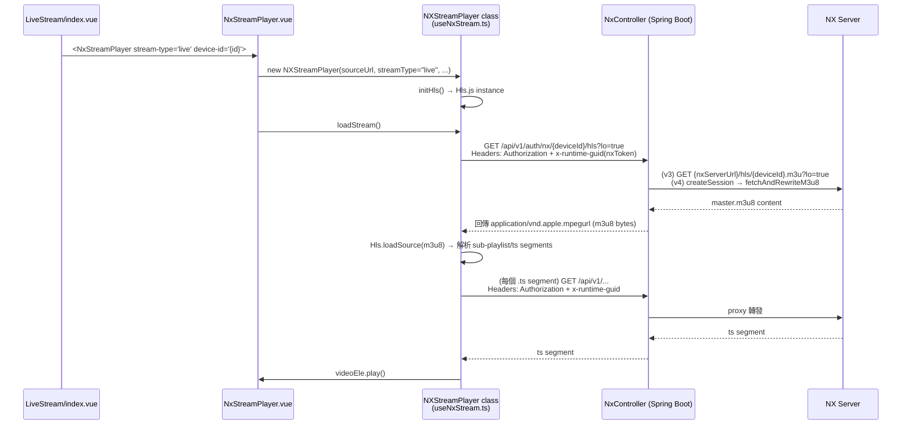
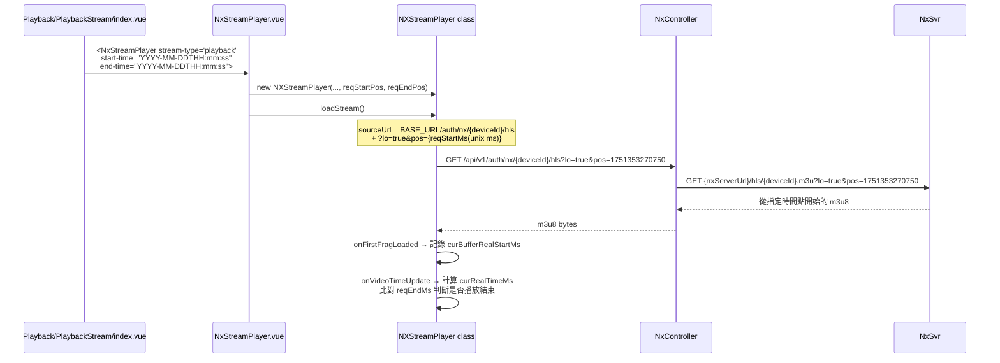

---

## NX 串流 API Flow

### 整體架構

兩種模式（live / playback）共用相同的 API 端點 `GET /v1/auth/nx/{deviceId}/hls`，差異只在 query string 的 `pos` 參數。

---

### 即時串流（Live）

---

### 歷史播放（Playback）

---

### 關鍵差異整理

| | 即時（Live） | 歷史（Playback） |
|---|---|---|
| **View** | `LiveStream/index.vue` | `Playback/PlaybackStream/index.vue` |
| **stream-type prop** | `"live"` | `"playback"` |
| **pos 參數** | 無 | `?pos={startTime unix ms}` |
| **start/end-time prop** | 無 | `dayjs.unix(startTime).format('YYYY-MM-DDTHH:mm:ss')` |
| **HLS config** | lowLatencyMode | maxBufferLength=240, backBufferLength=60 |
| **timeupdate listener** | 不綁定 | 綁定，監控進度 / 結束點 |
| **結束偵測** | 無 | `curRealTimeMs >= reqEndMs` → stopStream |

---

### NxController 後端邏輯（`/v1/auth/nx/{deviceId}/hls`）

- **v3 (NX 5.x)**：直接呼叫 `nxHttpService.downloadHLS()`，把 NX 回傳的 master m3u8 bytes 直接回應給前端；後續 .ts segments 由前端 hls.js 直連 NX（NX 5.x 不驗證 .ts 層）
- **v4 (NX 6.1+)**：呼叫 `hlsProxyService.createSession()` → `fetchAndRewriteM3u8()`，把 m3u8 內的所有 URL rewrite 成後端代理路徑，前端每個 .ts 請求都經後端轉發並自動加上 `x-runtime-guid`