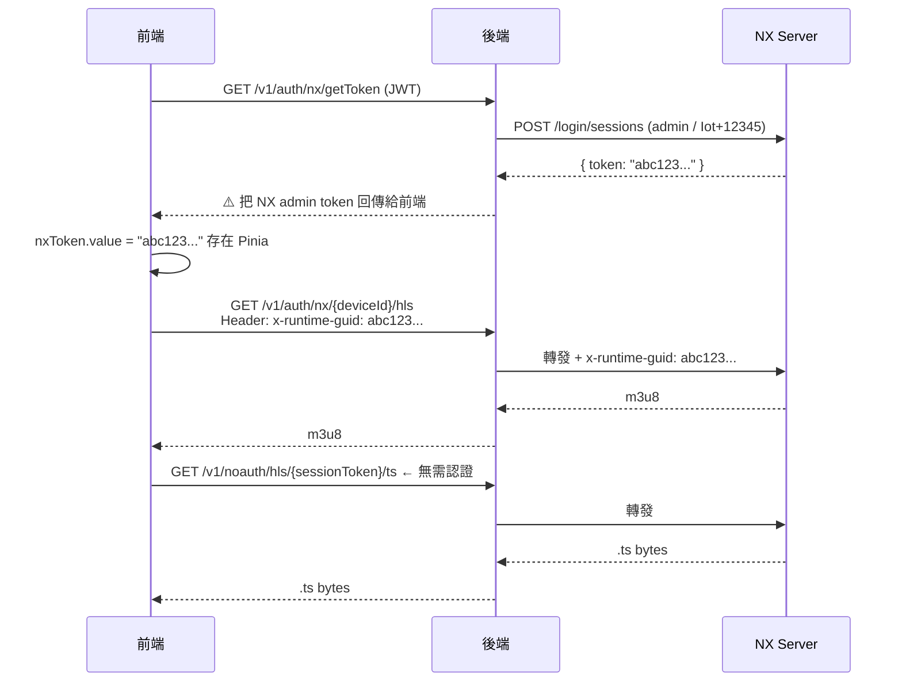
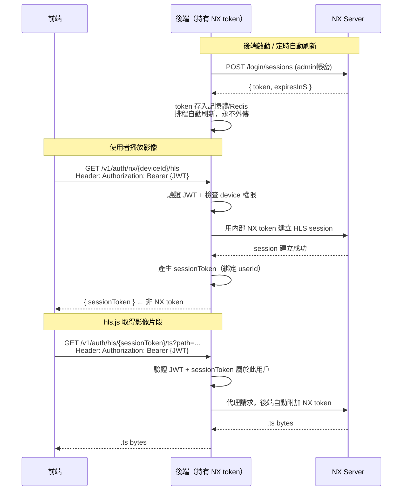
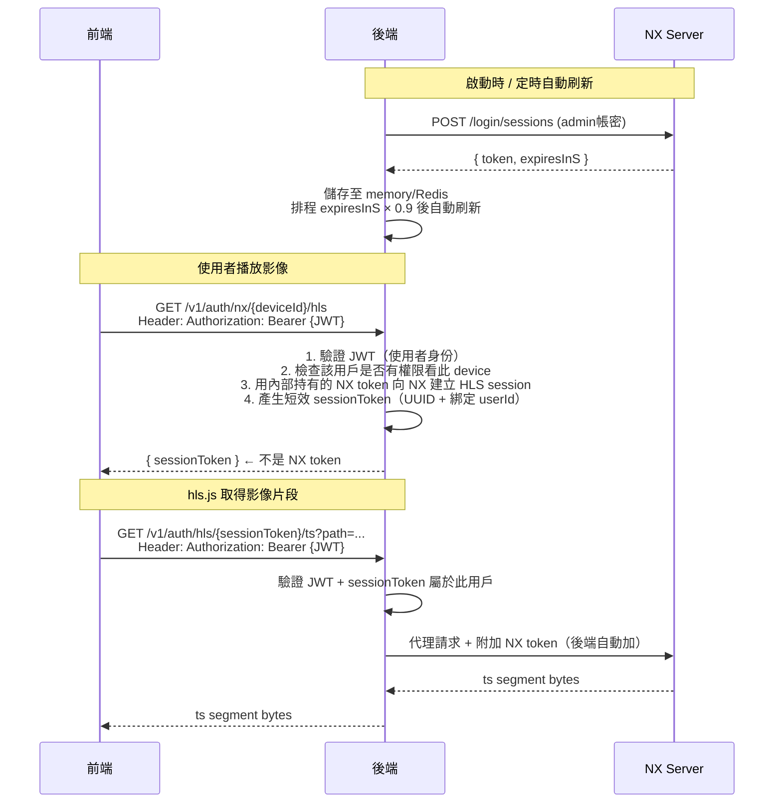

Updated todo list

## 理想的三層設計

---

### 核心原則

> **前端只認識後端，後端只認識 NX，NX token 永遠不離開後端。**

---

### 現況 vs 理想對比

Updated todo list

Mermaid 不支援在同一張圖裡並排兩個獨立流程。拆成兩張獨立圖：

---

### 現況（有問題）



---

### 理想設計



---

### 理想流程設計



---

### 各層職責

| 層 | 持有的憑證 | 對外暴露 | 職責 |
|---|---|---|---|
| **前端** | 自己的 JWT | 是 | 只帶 JWT；不知道 NX 的存在 |
| **後端** | NX admin token（記憶體/Redis） | **否** | 驗證使用者身份 + 權限；代理所有 NX 請求；管理 NX token 生命週期 |
| **NX Server** | — | 不對外 | 只接受來自後端的請求 |

---

### 需要的具體改動

**後端：移除 `getToken` API**
```java
// ❌ 刪除這個 endpoint，NX token 不應給前端
@GetMapping("/v1/auth/nx/getToken")
public BaseResponse<Object> getNxToken() { ... }
```

**後端：NX Token 集中管理**
```java
@Component
public class NxTokenManager {
    private volatile String cachedToken;
    
    @Scheduled(fixedDelayString = "#{nxTokenManager.refreshIntervalMs()}")
    public void refreshToken() {
        // 向 NX 登入，更新 cachedToken
    }
    
    public String getToken() { return cachedToken; }
}
```

**後端：HLS Proxy 端點加回 JWT 驗證**
```java
// ❌ 現況：/v1/noauth/hls/{sessionToken}/ts  → 完全無認證
// ✅ 改為：/v1/auth/hls/{sessionToken}/ts   → 需要 JWT
//    並驗證 sessionToken 是否屬於目前的 JWT 用戶
```

**後端：sessionToken 需綁定使用者**
```java
public String createSession(String userId, String deviceId, String hlsPath) {
    String sessionToken = UUID.randomUUID().toString();
    sessions.put(sessionToken, new HlsSession(
        userId,        // ← 綁定 userId
        deviceId,
        hlsPath,
        nxTokenManager.getToken(),  // ← NX token 在後端持有，不外傳
        Instant.now().plusSeconds(SESSION_TTL_SECONDS)
    ));
    return sessionToken;
}
```

**前端：移除 NX Token 相關邏輯**
```ts
// ❌ 刪除
import { getNXToken } from '@/api/nx'
getNXToken().then((res) => { nxToken.value = res.token })

// ❌ 刪除 streamStore 中的 nxToken ref
// ❌ NXStreamPlayer 不再需要傳入 nxToken 參數
// ✅ hls.js 只需帶 JWT，不需要 x-runtime-guid
```

---

### 改動後的安全邊界

```
Internet
   │
   ▼
[前端] ── JWT ──▶ [後端 /v1/auth/**]
                      │
                      │ 內網，NX token 永遠在此層
                      ▼
                 [NX Server]（不對外暴露）
```

- 即使前端 JWT 被竊，攻擊者也只能呼叫後端 API，無法直接操作 NX
- NX admin 密碼和 token 完全不出現在前端、log（需移除 token logging）、網路封包中
- 每個 HLS session 都有使用者歸屬，可完整稽核「誰在什麼時間看了哪支攝影機」