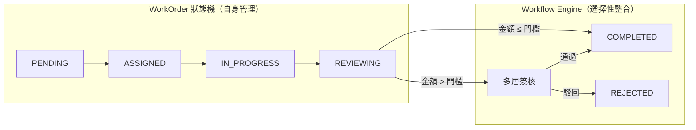

> WorkOrder 是否需要搭配 現有的workflow功能模組

# AI Say
很好的問題。答案是：**部分整合，但不應該完全依賴 Workflow Engine。**

---

## 為什麼不該把 WorkOrder 整個塞進 Workflow Engine

你現有的 `workflow` 模組是**審批流引擎**（approval workflow）：

```
申請 → 主管簽核 → 部門主管簽核 → 完成
```

而 WorkOrder 的生命週期是**作業流程**（operational workflow）：

```
民眾通報 → 派工 → 技師到場 → 維修 → 覆核 → 結案
```

這兩個流程的性質不同：

| 維度 | Approval Workflow | WorkOrder 作業流程 |
|------|------------------|------------------|
| 參與者 | 簽核者（主管） | 技師、班長、覆核員 |
| 動作 | 核准/駁回 | 到場、維修、更換零件、拍照上傳 |
| 狀態 | PENDING → APPROVED/REJECTED | 更複雜的多階段 |
| 時效 | 天為單位 | 小時為單位（可能有 SLA） |

把 WorkOrder 硬套進 Workflow Engine，你會遇到：

- 每個狀態轉換都要新增一個 workflow step，但大多數步驟（如「技師出發→到場」）不需要簽核
- 技師的 app 操作（GPS 打卡、拍照）跟 workflow engine 的設計不合
- SLA 計算（通報後 4 小時內到場）是 WorkOrder 特有的邏輯

---

## 建議：分層設計

```
WorkOrder 自己的狀態機（核心）
  ├── PENDING → ASSIGNED → IN_PROGRESS → REVIEWING → COMPLETED / REJECTED
  ├── SLA 計時、GPS 軌跡、附件管理
  └── 這些邏輯在 WorkOrderService 裡

         ↓ 只在「覆核」步驟呼叫

Workflow Engine（選配）
  └── 當「覆核」需要多層簽核時（如：維修金額 > 10 萬需經理核准）
       → 建立一個 WorkflowInstance，把覆核流程委託給 WorkflowEngine
```

### 實作方式

```java
// WorkOrderService.java — 只在特定條件下整合 workflow

@Transactional
public void submitForReview(Long workOrderId) {
    WorkOrder wo = workOrderRepository.findById(workOrderId).orElseThrow(...);
    wo.setStatus(WorkOrderStatus.REVIEWING);

    // 如果維修金額超過門檻，啟動多層簽核流程
    if (wo.getRepairCost() >= EXPENSIVE_THRESHOLD) {
        WorkflowInstance instance = workflowEngine.start(
            "WORK_ORDER_REVIEW",    // workflow definition code
            wo.getTenantId(),
            Map.of("workOrderId", wo.getId(),
                   "amount", wo.getRepairCost())
        );
        wo.setReviewWorkflowInstanceId(instance.getId());
        // 注意：狀態維持 REVIEWING，等 workflow 完成後 callback 更新
    }
    // 一般情況：直接完成覆核
    else {
        wo.setStatus(WorkOrderStatus.COMPLETED);
        wo.setCompletedAt(LocalDateTime.now());
    }
}

// Callback：workflow 完成後觸發
@Transactional
public void onReviewWorkflowCompleted(Long instanceId, boolean approved) {
    WorkOrder wo = workOrderRepository.findByReviewWorkflowInstanceId(instanceId);
    wo.setStatus(approved ? WorkOrderStatus.COMPLETED : WorkOrderStatus.REJECTED);
    if (approved) wo.setCompletedAt(LocalDateTime.now());
    else wo.setRejectReason("簽核未通過");
}
```

### 流程圖



---

## 總結

| 作法 | 結論 |
|------|------|
| WorkOrder 完全獨立（自己的狀態機） | ✅ 核心正確 |
| WorkOrder 完全交給 Workflow Engine | ❌ 不合適，作業流程 ≠ 審批流程 |
| 只在「覆核」步驟選擇性整合 Workflow Engine | ✅ 最佳實務 |

WorkOrder 模組自己管理**作業狀態**，只在需要**多層簽核**時 call workflow engine 的 API。這樣兩個模組各司其職，不互相綁死。