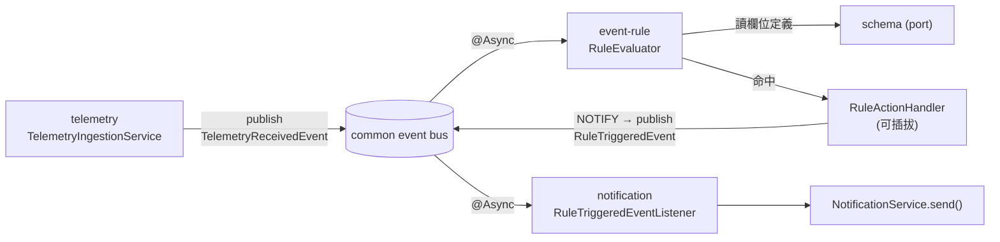

# Event Rule 模組設計（規劃）

> 日期：2026-06-30
> 延續：`h1.md`（選單定位：獨立頂層 `/event-rules`）、telemetry `4-module-architecture.md`（跨域事件契約）
> 定位：事件規則引擎 —— 訂閱 telemetry 事件、依規則比對、觸發動作（通知等）。獨立功能域，僅透過事件耦合。

---

## 一、模組定位與邊界

| 項目 | 內容 |
|---|---|
| Bounded context | 跨設備的事件判斷引擎，獨立演進 |
| 觸發來源 | `@Async` 監聽 `TelemetryReceivedEvent`（telemetry 發出，放 `common/event`） |
| 觸發產出 | 發 `RuleTriggeredEvent`（放 `common/event`），notification 監聽後送通知 |
| 依賴 | `schema`(port，讀 telemetry 欄位定義以供規則 UI/驗證)、`common`(event)、`redis`(狀態性規則) |
| **不依賴** | **不直接依賴 telemetry / notification 內部**（全走 common 事件） |
| 多租戶 | 事件攜帶 `tenantId`；`@Async` 執行緒需顯式還原 TenantContext（ThreadLocal 不繼承） |



---

## 二、規則模型（結構化條件，**不採任意腳本**）

> 安全考量：**不使用 SpEL / JS / Groovy 等可執行任意程式的表達式**（避免注入與 RCE）。改用**結構化 JSON 條件樹**，可被前端 UI 化、後端白名單驗證、安全求值。

### 規則定義（event_rule）

```jsonc
{
  "ruleId": "RULE_TEMP_HIGH",
  "name": "溫度過高告警",
  "enabled": true,
  "scope": {                      // 規則套用範圍
    "deviceType": "STREETLIGHT",  // 必填：規則綁定的設備型別（對應 schema）
    "deviceIds": null             // 選填：限定特定設備；null=該型別全部
  },
  "condition": {                  // 條件樹（見下）
    "op": "AND",
    "children": [
      { "field": "temperature", "operator": "GT", "value": 75 },
      { "field": "switch", "operator": "EQ", "value": "on" }
    ]
  },
  "trigger": {                    // 觸發語意（去抖動）
    "mode": "ON_MATCH",           // ON_MATCH | FOR_DURATION | ON_CHANGE
    "durationSec": 0,             // FOR_DURATION 用：持續滿足 N 秒才觸發
    "cooldownSec": 300            // 冷卻：N 秒內不重複觸發（防告警風暴）
  },
  "severity": "WARNING",          // INFO | WARNING | CRITICAL
  "actions": [                    // 觸發動作（可多個、可插拔）
    {
      "type": "NOTIFY",
      "channels": ["IN_APP", "EMAIL"],
      "recipients": { "roleCodes": ["OPERATOR"], "userIds": [] },
      "template": "device.temp.high"
    }
  ]
}
```

### 條件樹（condition tree）

- 葉節點：`{ field, operator, value }`
- 分支節點：`{ op: "AND" | "OR" | "NOT", children: [...] }`
- `field` 必須存在於該 `deviceType` 的 `schema.telemetry.properties`（建立規則時用 `SchemaProviderPort` 白名單驗證）

### 運算子白名單（可擴充）

> **第一版實作範圍（定案）**：巢狀 `AND` / `OR` / `NOT` + 運算子 `GT`（大於）/ `LT`（小於）/ `EQ`（等於）。其餘運算子（下表標 *後續*）列為擴充，求值引擎以白名單方式預留。

| operator | 適用型別 | 版本 | 說明 |
|---|---|---|---|
| `GT` | number | **v1** | 大於 |
| `LT` | number | **v1** | 小於 |
| `EQ` | number/string/bool | **v1** | 等於 |
| `GTE` / `LTE` | number | 後續 | 大於等於／小於等於 |
| `NEQ` | number/string/bool | 後續 | 不等於 |
| `BETWEEN` | number | 後續 | 區間 `[min,max]` |
| `IN` / `NOT_IN` | string/number | 後續 | 列舉集合 |
| `CONTAINS` | string | 後續 | 子字串 |
| `CHANGED` | any | 後續 | 與上一筆值不同（狀態性，需歷史值） |
| `CHANGED_TO` | string | 後續 | 變成特定值（如 `switch → fault`） |

邏輯節點 `AND` / `OR` / `NOT` 第一版即支援**任意巢狀**，前端條件樹編輯器同步支援巢狀群組。

---

## 三、觸發語意與狀態性規則

| mode | 行為 | 是否需狀態 |
|---|---|---|
| `ON_MATCH` | 每筆 telemetry 滿足條件即觸發（受 cooldown 限制） | 否（僅 cooldown） |
| `FOR_DURATION` | 條件**持續滿足** N 秒才觸發（去除瞬時抖動） | 是（記首次滿足時間） |
| `ON_CHANGE` | 條件結果由 false→true 邊緣觸發；或 `CHANGED*` 運算子 | 是（記上次結果/上次值） |

**狀態存放**：用 Redis（專案已有），key 例如 `evtrule:state:{ruleId}:{deviceId}`，存「首次滿足時間 / 上次結果 / 上次值 / 上次觸發時間（cooldown）」。TTL 自動回收。單機可記憶體，但多實例必須 Redis。

---

## 四、評估流程（RuleEvaluator）

```
@Async @TransactionalEventListener 不適用（非 DB 交易來源）→ 用 @Async @EventListener
1. 收到 TelemetryReceivedEvent(tenantId, deviceId, deviceType, ts, values)
2. 還原 TenantContext（顯式 set，因 @Async 不繼承 ThreadLocal）→ finally clear
3. 載入該 tenant + deviceType（+ deviceId 命中）的 enabled 規則（含快取）
4. 逐規則：
   a. 求值 condition tree（values 對照葉節點）
   b. 依 trigger.mode 套用狀態（Redis）：FOR_DURATION/ON_CHANGE/cooldown
   c. 命中 → 寫 event_rule_trigger_log → 對每個 action 呼叫對應 RuleActionHandler
5. 例外隔離：單一規則失敗不影響其他規則（best-effort，記 log）
```

**規則快取**：規則變動不頻繁、telemetry 量大 → 規則集以 `(tenantId, deviceType)` 為 key 快取（Caffeine/Redis），規則 CRUD 時失效。

---

## 五、動作可插拔（RuleActionHandler）

```java
interface RuleActionHandler {
    boolean supports(ActionType type);                 // NOTIFY / WEBHOOK / DEVICE_CMD / WORKFLOW...
    void execute(EventRule rule, RuleMatch match, ActionConfig action);
}
```

| Handler | 行為 | 階段 |
|---|---|---|
| `NotifyActionHandler` | 組 `RuleTriggeredEvent` → publish（notification 監聽後 `NotificationService.send`） | 先做 |
| `WebhookActionHandler` | 呼叫外部 HTTP（第三方整合） | 後續 |
| `DeviceCommandActionHandler` | 反向下令設備（MQTT command topic，閉迴路控制） | 後續 |
| `WorkflowActionHandler` | 觸發既有 workflow（如自動開工單） | 後續 |

> 新增動作類型 = 新增一個 `@Component` handler，核心評估引擎不動。

---

## 六、資料表設計

```sql
-- 規則定義
event_rule (
    id            BIGSERIAL PK,
    tenant_id     VARCHAR(50)  NOT NULL,
    rule_code     VARCHAR(50)  NOT NULL,
    name          VARCHAR(200) NOT NULL,
    device_type   VARCHAR(30)  NOT NULL,        -- 對應 schema
    enabled       BOOLEAN      NOT NULL DEFAULT true,
    severity      VARCHAR(20)  NOT NULL,
    scope         JSONB,                         -- deviceIds 等
    condition     JSONB        NOT NULL,         -- 條件樹
    trigger_cfg   JSONB        NOT NULL,         -- mode/duration/cooldown
    actions       JSONB        NOT NULL,         -- action 陣列
    create_time   TIMESTAMP, update_time TIMESTAMP,
    UNIQUE (tenant_id, rule_code)
);

-- 觸發記錄（與 telemetry_data 共用同一套時序儲存策略；定案）
-- 注意：僅「條件成立且通過 cooldown/duration 收斂後實際觸發」才寫一筆 → 遠比 telemetry_data 稀疏。
event_rule_trigger_log (
    id            BIGSERIAL PK,
    tenant_id     VARCHAR(50) NOT NULL,
    rule_id       BIGINT      NOT NULL,
    device_id     BIGINT      NOT NULL,
    triggered_at  TIMESTAMP   NOT NULL DEFAULT now(),
    severity      VARCHAR(20),
    matched_values JSONB,                        -- 命中當下的 values 快照
    action_result JSONB                          -- 各 action 執行結果
);
CREATE INDEX idx_evtlog_rule_time   ON event_rule_trigger_log(rule_id, triggered_at DESC);
CREATE INDEX idx_evtlog_device_time ON event_rule_trigger_log(device_id, triggered_at DESC);
```

> 規則的「即時狀態」（FOR_DURATION/cooldown）放 **Redis**，不落 DB。

---

## 七、Package 藍圖

```
com.taipei.iot.eventrule/
├── entity/
│   ├── EventRule.java
│   └── EventRuleTriggerLog.java
├── repository/
│   ├── EventRuleRepository.java
│   └── EventRuleTriggerLogRepository.java
├── model/                              ← 條件樹/動作的 POJO（與 JSONB 對映）
│   ├── ConditionNode.java
│   ├── TriggerConfig.java
│   └── ActionConfig.java
├── evaluation/
│   ├── TelemetryRuleListener.java      @Async @EventListener(TelemetryReceivedEvent)
│   ├── RuleEvaluator.java              條件樹求值 + 狀態判斷
│   ├── ConditionEvaluator.java         運算子白名單求值
│   └── RuleStateStore.java             Redis 狀態（duration/cooldown/last value）
├── action/
│   ├── RuleActionHandler.java          介面（擴展點）
│   ├── RuleActionDispatcher.java
│   └── NotifyActionHandler.java        publish RuleTriggeredEvent
├── service/
│   ├── EventRuleService.java           規則 CRUD + 白名單驗證(用 SchemaProviderPort)
│   └── EventRuleCache.java             (tenantId, deviceType) → rules
├── controller/
│   ├── EventRuleController.java        規則 CRUD API
│   └── EventRuleTriggerLogController.java  觸發記錄查詢
└── dto/
```

notification 端新增（屬 notification 模組，不屬 event-rule）：
```
com.taipei.iot.notification/listener/RuleTriggeredEventListener.java
   @Async @EventListener(RuleTriggeredEvent) → 組 NotificationPayload → NotificationService.send()
```

---

## 八、跨域契約（放 common，沿用既有 common/event 慣例）

```java
// common/event —— 由 telemetry 發、event-rule 收
record TelemetryReceivedEvent(String tenantId, Long deviceId, String deviceType,
                              Instant ts, Map<String,Object> values) {}

// common/event —— 由 event-rule 發、notification 收
record RuleTriggeredEvent(String tenantId, Long deviceId, String ruleId, String ruleName,
                          String severity, Instant triggeredAt,
                          Map<String,Object> matchedValues,
                          List<String> channels,
                          RecipientSpec recipients, String template) {}
```

> 與既有 `common/event/LoginAuditEvent`、`VirusScanAuditEvent` 完全同模式：common 定義事件、消費模組以 `@EventListener` 訂閱。

---

## 九、REST API

| Method | Path | 權限 | 說明 |
|---|---|---|---|
| `GET` | `/v1/auth/event-rules` | `EVENT_RULE_VIEW` | 規則列表（分頁/篩選 deviceType、enabled） |
| `POST` | `/v1/auth/event-rules` | `EVENT_RULE_MANAGE` | 建立規則（condition 經 schema 白名單驗證） |
| `PUT` | `/v1/auth/event-rules/{id}` | `EVENT_RULE_MANAGE` | 更新（失效快取） |
| `PATCH` | `/v1/auth/event-rules/{id}/enabled` | `EVENT_RULE_MANAGE` | 啟用/停用 |
| `DELETE` | `/v1/auth/event-rules/{id}` | `EVENT_RULE_MANAGE` | 刪除 |
| `GET` | `/v1/auth/event-rules/{id}/logs` | `EVENT_RULE_VIEW` | 該規則觸發記錄 |
| `GET` | `/v1/auth/event-rules/logs` | `EVENT_RULE_VIEW` | 全域觸發記錄（分頁/時間範圍/severity） |

選單（沿用 h1.md）：`/event-rules`（事件規則定義、觸發記錄）。

---

## 十、落地順序

1. **契約**：`common/event` 補 `RuleTriggeredEvent`（`TelemetryReceivedEvent` 由 telemetry 階段已建）
2. **model + entity + repository**：`ConditionNode`/`EventRule`/`EventRuleTriggerLog` + JSONB 對映
3. **求值核心**：`ConditionEvaluator`（運算子白名單）+ `RuleEvaluator`（純單元測試，不接事件）
4. **狀態層**：`RuleStateStore`（Redis：duration/cooldown/onChange）
5. **事件接入**：`TelemetryRuleListener`（`@Async @EventListener` + TenantContext 還原）
6. **動作**：`RuleActionHandler` + `NotifyActionHandler`；notification 端加 `RuleTriggeredEventListener`
7. **CRUD**：`EventRuleService`（schema 白名單驗證）+ `EventRuleCache` + Controller
8. **DB migration**：`event_rule`、`event_rule_trigger_log` + 選單 + 權限碼
9. **前端**：規則 CRUD UI（條件樹編輯器）、觸發記錄查詢

---

## 十一、決策定案與待確認

### 已定案（2026-06-30）

- ✅ **條件樹**：第一版支援**任意巢狀 `AND` / `OR` / `NOT`** + 運算子 `GT` / `LT` / `EQ`。其餘運算子白名單預留、後續擴充。
- ✅ **觸發記錄儲存**：`event_rule_trigger_log` 與 `telemetry_data` **共用同一套時序儲存策略**；**僅事件實際成立觸發才寫一筆**（經 cooldown/duration 收斂），故量級遠低於 telemetry_data。實際儲存引擎（TimescaleDB vs 原生 PG）隨 telemetry 環境一併決定。
- ✅ **`@Async` TenantContext 還原**：採**顯式** `TenantContext.setCurrentTenantId(event.tenantId())` → `finally` clear（規則本就 tenant-scoped，不用系統情境）。

### 待確認

- [ ] **規則求值的設備上一筆值**（`CHANGED*` / `ON_CHANGE`，屬後續運算子）：從 Redis 狀態取，或查 telemetry 最新一筆？傾向 Redis 狀態（避免 DB 壓力）。
- [ ] **動作擴充優先序**：NOTIFY 先做；`DEVICE_CMD`（反向控制）牽涉 MQTT 下行與安全，需另開設計。

---

## 附錄：與既有架構決策一致性

- **事件驅動解耦**：`telemetry → event-rule → notification` 全走 `common/event`，無編譯期相依環（同 `4-module-architecture.md`）。
- **schema 為定義層**：event-rule 透過 `SchemaProviderPort` 讀欄位定義做白名單，單向消費、不產生環。
- **安全優先**：條件採結構化白名單求值，**不引入任意腳本執行**（避免注入/RCE）。
- **既有非同步慣例**：沿用 `audit` 的 `@EnableAsync` + 專屬 executor + `@Async @EventListener` 模式。
