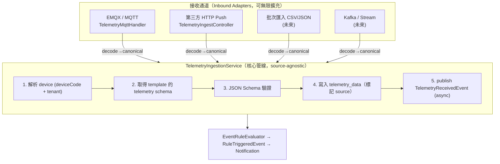

Updated todo list

好問題。這正是 IoT 平台的「多來源接入」經典課題。核心設計原則是：**把「接收通道」和「核心處理管線」徹底解耦** —— 用你在 `device↔schema` 那邊已經在用的 Ports & Adapters 模式，讓 telemetry 的入口可以無限擴展，而核心驗證／儲存／事件流完全不變。

## 一、核心原則：來源匯流（Inbound Adapters → 單一核心管線）



關鍵：**所有來源在進入「核心管線」前先被轉成同一個 canonical 模型**。核心管線、event-rule、notification 完全不知道資料是從 MQTT 還是 API 來的 —— 新增來源 = 新增一個 adapter，**核心零修改**。

## 二、統一的 canonical 內部模型

不論來源，都先收斂成同一個 command：

```java
public record TelemetryIngestRequest(
    String deviceCode,            // 已映射成「平台內部」設備碼
    Instant ts,                   // 可為 null → 由伺服器補 received_at
    Map<String, Object> values,   // 待驗證的遙測值
    String tenantId,              // 由通道認證解析出
    TelemetrySource source,       // MQTT / HTTP_API / BATCH ...
    String sourceClientId,        // 哪個廠商/客戶端送的（稽核用）
    JsonNode rawPayload           // 原始 payload（偵錯/重放）
) {}

public enum TelemetrySource { MQTT, HTTP_API, BATCH_IMPORT, KAFKA }
```

## 三、單一核心服務（所有來源的匯流點）

```java
public interface TelemetryIngestionService {
    TelemetryIngestResult ingest(TelemetryIngestRequest req);
    List<TelemetryIngestResult> ingestBatch(List<TelemetryIngestRequest> reqs); // API 常一次送多筆
}
```

你原設計裡 `TelemetryMqttHandler` 的「驗證 + 寫入 + 發事件」邏輯，全部**上移**到這個 service。`TelemetryMqttHandler` 退化成純 adapter（只負責解析 MQTT payload → 呼叫 `ingest()`）。

## 四、擴展點 1：廠商格式多樣性 → Decoder Registry

第三方廠商的 payload 格式通常**各家不同**（欄位名、巢狀結構、時間格式都不一樣）。這是最大的擴展痛點。解法是再加一層 decoder，**每個廠商一個 decoder，核心不動**：

```java
public interface TelemetryPayloadDecoder {
    boolean supports(String sourceClientId);          // 或 contentType / vendor header
    List<TelemetryIngestRequest> decode(RawInbound raw, IngestContext ctx);
}
```

- `CanonicalTelemetryDecoder` —— 預設，處理你設計的 `{ts, values}` 標準格式。
- `VendorAFooDecoder`、`VendorBDecoder` —— 廠商 A/B 的專屬格式，各自實作把專有 JSON 攤平成 canonical。
- 一個 `TelemetryDecoderRegistry` 依 `sourceClientId` 解析出對應 decoder。

> 新接一家廠商 = 寫一個 `@Component` decoder + 一筆來源設定，**0 行核心修改**。這就是「易擴展」的核心。

## 五、擴展點 2：設備識別映射（external id → 內部 deviceCode）

第三方常用**自己的設備編號**，不是平台的 `deviceCode`。所以 decoder 階段要做一次映射。建議用一張映射表（也支援未來「一個外部 source 對多設備」）：

```sql
device_external_ref (
    id, tenant_id, source_client_id,
    external_device_id   VARCHAR,   -- 廠商給的 id
    device_code          VARCHAR,   -- 對應平台內部設備
    UNIQUE (source_client_id, external_device_id)
)
```

MQTT 來源因為 topic 就是 `device/{deviceCode}/telemetry`，本身就是內部碼，可直接略過此映射。

## 六、擴展點 3：第三方 API 的安全與多租戶

REST 通道不能用 MQTT 的認證，要獨立一套**逐廠商憑證**：

```sql
telemetry_ingest_client (
    client_id        VARCHAR PRIMARY KEY,   -- 廠商用戶端
    secret_hash      VARCHAR,               -- API key / client secret（雜湊）
    tenant_id        VARCHAR,               -- 綁定租戶 → 解出 TenantContext
    allowed_devices  JSONB,                 -- 可選：限制能上送的設備範圍
    rate_limit_qps   INT,
    enabled          BOOLEAN
)
```

- 一個 `IngestApiKeyAuthFilter`：驗 API key → 設 `TenantContext` + `sourceClientId`。
- 路徑獨立於使用者 API：例如 `POST /v1/ingest/telemetry`（不是 `/v1/auth/...`），走機器對機器認證（API Key 或 OAuth2 client-credentials），不掛使用者 JWT。
- 逐 client 限流（你專案已有 Redis，可用 token bucket）。

## 七、吞吐量：同步驗證 vs 緩衝接收

第三方 API 量大時，不要在 HTTP 請求內同步做完驗證＋寫庫。建議兩段式：

| 模式 | 行為 | 適用 |
|---|---|---|
| 同步 | 收到→驗證→寫庫→回 200/422 | 低量、需即時回驗證結果 |
| 緩衝（推薦高量）| 收到→輕量檢查→回 **202 Accepted**→丟內部 queue 非同步處理 | 高量、可容忍最終一致 |

緩衝層初期可用你已選的 Spring `ApplicationEvent`（`RawTelemetryReceivedEvent`）→ `@Async` 消費；規模上來再換 Redis Stream / Kafka。這跟你 event-rule 的非同步策略一致。

## 八、telemetry_data 加上來源欄位

原表補兩欄即可（之後查詢/稽核可追來源）：

```sql
ALTER TABLE telemetry_data
    ADD COLUMN source            VARCHAR(20) NOT NULL DEFAULT 'MQTT',   -- MQTT / HTTP_API ...
    ADD COLUMN source_client_id  VARCHAR(50);                          -- 哪個廠商客戶端
```

## 九、模組結構調整（對應你原設計第六節）

```
telemetry/
├── ingest/
│   ├── TelemetryIngestionService.java        ← 核心管線（驗證+寫入+發事件）
│   ├── TelemetryIngestRequest.java           ← canonical 模型
│   ├── decoder/
│   │   ├── TelemetryPayloadDecoder.java       ← 介面（擴展點）
│   │   ├── TelemetryDecoderRegistry.java
│   │   └── CanonicalTelemetryDecoder.java     ← 預設格式
│   └── source/
│       ├── mqtt/TelemetryMqttHandler.java     ← MQTT adapter（退化成純轉接）
│       └── http/TelemetryIngestController.java← 第三方 API adapter
│             + IngestApiKeyAuthFilter.java
```

---

**一句話總結**：把「驗證＋儲存＋發事件」抽成 source-agnostic 的 `TelemetryIngestionService`；MQTT 和 HTTP 各自只是一個薄 adapter；廠商格式差異交給可插拔的 `Decoder`；安全與設備映射在 adapter/decoder 層處理。日後加任何新來源（Kafka、批次、另一家廠商）都只動外圈、不碰核心。

要不要我把這套「多來源接入」設計補進 2-telemetry-design.md（新增一節「多來源 Telemetry 接入架構」），並順手把第六節模組結構與 telemetry_data 欄位更新成上面這版？