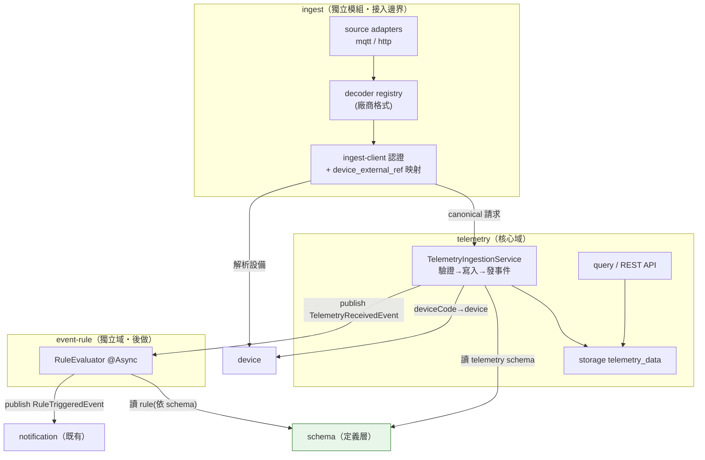

# Telemetry 功能模組架構（最終版）

> 日期：2026-06-30
> 延續：`2-telemetry-design.md`（JSON 格式與 Schema 驗證）、`3.md`（多來源接入討論）
> 本文為「功能模組切分」定案，作為後續實作的藍圖。

---

## 決策摘要

1. **多來源接入抽成獨立 `ingest` 模組**：MQTT/HTTP/未來 Kafka 等只是外圈 adapter，核心零修改。
2. **`event-rule` 維持獨立功能域**，僅透過事件與 telemetry 耦合（telemetry 先做、event-rule 後做）。
3. **依賴方向全部單向、無環**：`ingest → telemetry → {schema, device}`、`event-rule → schema`，跨域事件全走 `common`。
4. **schema 為定義層**：被 device / telemetry / event-rule 單向消費，不回頭依賴任何人。

---

## 一、最終模組全景（ingest 獨立）



---

## 二、模組邊界與依賴（全部單向、無環）

| 模組 | 職責 | 依賴 | 被誰依賴 |
|---|---|---|---|
| **ingest**（獨立） | 協定接收、廠商認證、payload 解碼成 canonical、外部設備碼映射 → 轉交 telemetry | `telemetry`、`device`、`common` | 無（最外圈） |
| **telemetry**（核心） | Schema 驗證、寫入 `telemetry_data`、查詢 API、發 `TelemetryReceivedEvent` | `schema`(port)、`device`(port)、`common` | `ingest` |
| **event-rule**（獨立） | `@Async` 監聽事件、規則比對、發 `RuleTriggeredEvent` | `schema`(port)、`common`(event) | 無（事件驅動） |
| **schema**（定義層） | `attributes`/`telemetry` 模板 CRUD 與提供 | 無（最底層） | telemetry、event-rule、device |
| **device** | 設備註冊、deviceCode↔tenant 解析 | `schema` | ingest、telemetry |
| **notification**（既有） | Email/STOMP | `common`(event) | 無 |

**關鍵交接**：`ingest` 把多來源全部收斂成 canonical `TelemetryIngestRequest` 後，呼叫 `telemetry` 的 `TelemetryIngestionService.ingest()`。telemetry 完全不認得 MQTT/HTTP/廠商格式 —— 新增來源只動 ingest，不碰核心。

---

## 三、Package 藍圖（兩個獨立 top-level）

```
com.taipei.iot.ingest/                      ← 獨立模組
├── source/
│   ├── mqtt/TelemetryMqttHandler           EMQX 訂閱
│   └── http/
│       ├── TelemetryIngestController        POST /v1/ingest/telemetry
│       └── IngestApiKeyAuthFilter           機器對機器認證
├── decoder/
│   ├── TelemetryPayloadDecoder              介面（擴展點）
│   ├── TelemetryDecoderRegistry
│   └── CanonicalTelemetryDecoder            預設 {ts,values}
├── client/
│   ├── TelemetryIngestClient (entity)       廠商憑證
│   ├── DeviceExternalRef (entity)           外部碼→deviceCode
│   └── ...Repository / 管理 API
└── (依賴 telemetry.TelemetryIngestionService)

com.taipei.iot.telemetry/                   ← 核心域
├── ingest/
│   ├── TelemetryIngestionService            介面（ingest 模組呼叫此）
│   ├── TelemetryIngestionServiceImpl        驗證+寫入+發事件
│   └── TelemetryIngestRequest               canonical 模型
├── validation/TelemetryValidationService    JSON Schema（networknt）
├── storage/
│   ├── TelemetryData (entity)
│   └── TelemetryDataRepository
└── query/
    ├── TelemetryDataService
    ├── TelemetryController                   GET /v1/auth/telemetry/...
    └── dto/

com.taipei.iot.eventrule/                   ← 獨立域（後做）
└── (監聽 TelemetryReceivedEvent)
```

---

## 四、跨域契約（port 放 common、event 放 common）

沿用 `DeviceTypeUsageGuard` 的做法，邊界全部放 `common`，避免任何模組 import 另一個模組內部：

```java
// common/schema/port
interface SchemaProviderPort { JsonNode getTelemetrySchema(String deviceType); }

// common/device/port
interface DeviceLookupPort { DeviceRef resolve(String deviceCode, String tenantId); }

// common/event —— 跨域事件，誰都不擁有誰
record TelemetryReceivedEvent(String tenantId, Long deviceId, String deviceType,
                              Instant ts, Map<String,Object> values) {}
record RuleTriggeredEvent(String tenantId, Long deviceId, String ruleId,
                          String severity, Map<String,Object> context) {}
```

> 兩個 event 放 `common`：`telemetry` 發、`event-rule` 收、`notification` 收，三方都只依賴 `common`，徹底無環。未來 event-rule 換 Redis Stream / Kafka 時，telemetry 完全無感。

---

## 五、資料表歸屬

| 表 | 模組 | 備註 |
|---|---|---|
| `telemetry_data` | telemetry.storage | 主時序表（**定案：原生 PG range partition by ts （月） + BRIN + 排程 retention**，不用 TimescaleDB；包 storage 抽象層，未來可換 hypertable） |
| `telemetry_ingest_client` | ingest.client | 第三方 API 憑證（API key / client secret 雜湊、tenant、device scope、限流、啟用旗標） |
| `device_external_ref` | ingest.client | 外部設備碼 → 內部 deviceCode 映射 |
| `device_templates`（拆 attributes/telemetry） | schema | 既有表・Step 2 改造 |
| event-rule 相關表 | event-rule | 後做 |

---

## 六、落地順序（契約先行）

1. **契約層（common）**：`SchemaProviderPort`、`DeviceLookupPort`、`TelemetryReceivedEvent`、`RuleTriggeredEvent` ← 先釘死邊界
2. **schema 改造**：`device_templates.schema` 拆 `attributes`/`telemetry`（Step 2）+ `SchemaProviderPort` adapter
3. **telemetry 核心**：storage + validation + `TelemetryIngestionService`（純單元測試，不接來源）
4. **ingest 模組**：先 mqtt adapter（接 EMQX）→ 再 http adapter + client 憑證/映射
5. **telemetry query/api**：歷史／即時／統計
6. **event-rule**：監聽事件、規則比對、發 `RuleTriggeredEvent`
7. **前端**：live / history

---

## 待辦／待確認

- [x] **儲存方案（定案 2026-06-30）**：採**原生 PostgreSQL range partition（按 ts 月分區）+ BRIN index + `@Scheduled` retention（DROP/DETACH 舊分區）**，不依賴 TimescaleDB。理由：本機 PG 18.3 僅能裝 `+dfsg` 重打包版（極可能缺 `add_retention_policy`／continuous aggregates 等 TSL 功能），且安裝需改 `shared_preload_libraries` + 重啟 Postgres。原生方案 schema-agnostic、dev/test 皆可跑。`telemetry.storage` 包一層抽象，未來規模上來可平滑換 hypertable。詳見 `2-telemetry-design.md` 第五節。
- [ ] 確認 ArchUnit 在新模組就緒後收緊 `no_cyclic_dependencies`。

---

## 附錄：與既有架構決策的一致性

- **Ports & Adapters**：延續 `device↔schema` 解環時建立的 `common/.../port` 模式（見 `00-history/03-model/`）。
- **schema 為定義層**：本架構中 schema 仍位於最底層，被 device / telemetry / event-rule 單向消費，不產生環。
- **事件驅動解耦**：telemetry → event-rule → notification 全走 `common` 事件，無編譯期相依環。
