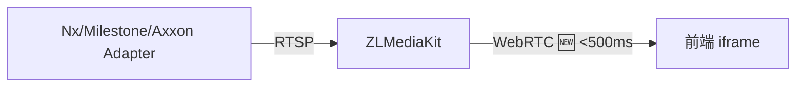

# VMS 整合 — 實作執行計畫

> 日期：2026-07-08
> 基於：`2-vms-architecture-design.md`（架構設計定案）
> 本文把落地順序展開成可逐項勾選的工程任務，含檔案、類別、migration、測試案例與驗收標準。
> 規範：後端用 `mvn`（非 `./mvnw`）；改 Java 後跑 `mvn spring-javaformat:apply -q`；新 migration 從 V8+ 起、保持 schema-agnostic。

---

## 進度總覽

| Phase | Step | 模組 | 狀態 | 產出 |
|---|---|---|---|---|
| **1** | 1 | 資料庫 migration | ✅ | V21__create_vms_core.sql（vms_servers, vms_cameras, vms_camera_events, perms, menus） |
| **1** | 2 | Entity / Repository / Enum | ✅ | VmsType, CameraStatus, VmsEventType, VmsAuthType enums + VmsServer/VmsCamera/VmsCameraEvent entities + 3 repositories + 3 unit tests |
| **1** | 3 | VMS Adapter 核心框架 | ✅ | VmsAdapter 介面 + VmsAdapterManager + CameraStreamInfo/PtzCommand DTO + ErrorCode 88100-88108 + 5 unit tests |
| **1** | 4 | Nx Witness Adapter（首個實作） | ✅ | NxWitnessAdapter（RestClient + VmsServerRepository）+ MockRestServiceServer 5 案測試 |
| **1** | 5 | ZLMediaKit 整合 + 串流服務 | ✅ | VmsProperties + VmsConfig + ZlMediaKitClient + VmsStreamService/Impl + CameraLiveResponse/PlaybackResponse + 2 測試檔共 9 案 |
| **1** | 6 | REST Controller（即時/回放/PTZ） | ✅ | VmsController + VmsCameraResponse DTO + 8 案 MVC slice 測試 |
| **2** | 7 | VMS 事件系統 | ✅ | VmsEvent DTO + VmsCameraEvent(record) + VmsEventService + VmsCameraEventListener + VmsWebhookController + NotificationRefType.VMS_EVENT + 9 案測試 |
| **2** | 8 | 串流安全性 | ✅ | StreamTokenService(Redis) + VmsStreamHookController(ZLMediaKit hooks) + VmsStreamServiceImpl token 注入 + 8 案測試 |
| **2** | 9 | VMS 管理 CRUD | ✅ | VmsServerRequest/Response + VmsCameraRequest + VmsAdminService + VmsAdminController + testConnection + 17 案測試 |
| **3** | 10 | Milestone Adapter | ✅ | MilestoneAdapter（GET /API/rest/v2/）+ MockRestServiceServer 5 案測試 |
| **3** | 11 | Axxon Adapter | ✅ | AxxonAdapter（GET /api/rest/v1/）+ MockRestServiceServer 5 案測試 |
| **4** | 12 | 前端 Types + API 層 | ✅ | `src/types/vms.ts` + `src/api/vms/index.ts` |
| **4** | 13 | 前端 Views | ✅ | VmsLiveView + VmsPlaybackView + VmsServerManagement + VmsEventLogs |
| **4** | 14 | 前端 Routes + i18n | ✅ | Router 4 條 VMS 路由 + zh-TW/zh-CN/en 三語系 vms.* 鍵值 |
| **4** | 15 | 多工格播放畫面 | ⬜ | VmsMultiGridView + grid layout + 1×1~4×4 切換 |

---

## Phase 1 — 核心模組

---

### Step 1 — 資料庫 Migration

**目標**：建立 VMS 核心資料表、權限、選單。

#### 1.1 Migration 腳本

- [v] `V8__create_vms_core.sql`
  - `vms_servers` 表（tenant_id, name, vms_type, base_url, auth_type, auth_username, auth_password, api_token, is_active, created_at, updated_at）
  - `vms_cameras` 表（tenant_id, server_id FK, vms_camera_id, display_name, device_id nullable, rtsp_url, status, metadata JSONB, created_at, updated_at, UNIQUE(server_id, vms_camera_id)）
  - `vms_camera_events` 表（tenant_id, camera_id FK, event_type, payload JSONB, occurred_at, created_at）
  - 權限：`PERM_VMS_VIEW('VMS_VIEW', '即時影像檢視')`、`PERM_VMS_MANAGE('VMS_MANAGE', '影像系統管理')`
  - 選單：目錄「影像監控」`parent_id` 查詢既有 `dashboard` 目錄；子選單「即時影像」`/vms/live`、「歷史回放」`/vms/playback`、「VMS 管理」`/vms/servers`
  - schema-agnostic（無 schema 前綴、無 search_path）

#### 1.2 驗收

- [x] `V21__create_vms_core.sql` 已建立於 migration 目錄 — 含 vms_servers / vms_cameras / vms_camera_events + permissions + menus（menu_id=150~154）
- [ ] `mvn flyway:info` 顯示 V21 已套用（需有 DB 連線）
- [ ] psql 確認 tables 建立、FK 正確、權限及選單資料存在

---

### Step 2 — Entity / Repository / Enum

**目標**：建立 JPA 映射層，對齊專案既有 entity pattern（`TenantAware`、`@Filter`、`@EntityListeners`）。

#### 2.1 Enum

- [x] `vms/enums/VmsType.java` — `NX_WITNESS, MILESTONE, AXXON`
- [x] `vms/enums/CameraStatus.java` — `ONLINE, OFFLINE, ERROR`
- [x] `vms/enums/VmsEventType.java` — `MOTION_DETECT, CAMERA_OFFLINE, ...`
- [x] `vms/enums/VmsAuthType.java` — `BASIC, TOKEN, CERT`

#### 2.2 Entity

- [x] `vms/entity/VmsServer.java` — TenantAware, @Filter, @EntityListeners, @Builder
- [x] `vms/entity/VmsCamera.java` — @ManyToOne VmsServer, JSONB metadata, TenantAware
- [x] `vms/entity/VmsCameraEvent.java` — @ManyToOne VmsCamera, JSONB payload, explicit tenantId (no @Filter)

#### 2.3 Repository

- [x] `vms/repository/VmsServerRepository.java`
- [x] `vms/repository/VmsCameraRepository.java`
- [x] `vms/repository/VmsCameraEventRepository.java`

#### 2.4 測試

- [x] `VmsServerTest` — 3 cases: builder, defaults, TenantAware
- [x] `VmsCameraTest` — 3 cases: builder+metadata, defaults, TenantAware
- [x] `VmsCameraEventTest` — 2 cases: builder+payload, TenantAware

**驗收**：IDE 編譯零錯誤（`get_errors` 無 vms 相關 error），entity 映射正確。

---

### Step 3 — VMS Adapter 核心框架

**目標**：建立 Strategy Pattern 框架，讓未來各 VMS 實作可以 plug-and-play。

#### 3.1 Java 類別

- [x] `vms/dto/CameraStreamInfo.java` — record: cameraId, rtspUrl, displayName, vmsType, metadata
- [x] `vms/dto/PtzCommand.java` — record: direction @NotBlank, speed, presetPoint
- [x] `vms/VmsAdapter.java` — Port 介面（getType / getLiveStreamUrl / getPlaybackUrl / controlPtz / getCameraInfo / listCameras / healthCheck）
- [x] `vms/VmsAdapterManager.java` — Registry（同 `TelemetryDecoderRegistry` 模式：List injection → Map, getAdapter 拋 BusinessException, allAdapters）
- [x] `ErrorCode` 新增：`VMS_SERVER_NOT_FOUND(88100)` ~ `VMS_EVENT_PROCESSING_FAILED(88108)` 共 9 碼

#### 3.2 測試

- [x] `VmsAdapterManagerTest` — 5 案：單一註冊、多 adapter 查詢、未知類型拋錯、空列表、allAdapters
- [ ] ArchUnit 測試：`vms` 只依賴 `vms` 內部 + `common`（待最終通用驗收）

**驗收**：IDE 編譯零錯誤，VmsAdapterManager 可正確調度 adapter。

---

### Step 4 — Nx Witness Adapter（首個實作）

**目標**：實作第一個 VMS Adapter，以 Nx Witness 為標的，驗證完整流程。

#### 4.1 Java 類別

- [x] `vms/adapter/NxWitnessAdapter.java`
  - `@Service` + `@RequiredArgsConstructor`
  - 注入 `VmsServerRepository`，`buildRestClient()` 依 server baseUrl/authType 動態建立 `RestClient`
  - 實作所有方法：`getLiveStreamUrl` (POST /ec2/cameras/{id}/streams)、`getPlaybackUrl`、`controlPtz` (PUT /ec2/cameras/{id}/ptz)、`getCameraInfo` (GET /ec2/cameras/{id})、`listCameras` (GET /ec2/cameras?page=)、`healthCheck` (GET /ec2/server/info)
  - 內部 DTO：`StreamRequest`、`PlaybackStreamRequest`、`NxPtzRequest`、`NxStreamResponse`、`NxCameraInfoResponse`、`NxCameraListResponse`、`NxCameraItem`

#### 4.2 測試

- [x] `NxWitnessAdapterTest`（`MockRestServiceServer`，5 案含巢狀類別）
  - `getLiveStreamUrl`: 成功回傳 RTSP URL、空回應拋 `VMS_STREAM_NOT_AVAILABLE`
  - `controlPtz`: 成功發送 PUT 請求
  - `healthCheck`: VMS 正常→true、異常→false
  - `resolveServer`: 無啟用 server 拋 `VMS_SERVER_NOT_FOUND`

**注意**：Adapter 不直接寫入 DB；僅轉換 VMS API 回應為 `CameraStreamInfo` / `VmsCamera` DTO。資料同步由 `VmsStreamService` 負責。

---

### Step 5 — ZLMediaKit 整合 + 串流服務（WebRTC 輸出）

**目標**：建立媒體伺服器客戶端，以及協調 adapter → media server → cache 的核心服務。所有 VMS adapter 的 RTSP 串流統一經 ZLMediaKit 轉為 **WebRTC** 輸出。



#### 5.1 Java 類別

- [x] `vms/config/VmsProperties.java` — @ConfigurationProperties(prefix="vms"): mediaServer, streamCacheTtlSeconds, streamIdleTimeoutSeconds, webhookAllowedIps, **webrtc (enabled, port, stunServer)**
- [x] `vms/config/VmsConfig.java` — @EnableConfigurationProperties
- [x] `vms/dto/CameraLiveResponse.java` — record: cameraId, displayName, playUrl, expiresAt, status
- [x] `vms/dto/CameraPlaybackResponse.java` — record: cameraId, displayName, playUrl, startTime, endTime, status
- [x] `vms/service/ZlMediaKitClient.java`
  - RestClient base on `vms.media-server.api-url`，使用 `RestClient.Builder` injection
  - `addStreamProxy(rtspUrl, streamId)` → POST /index/api/addStreamProxy → **WebRTC player URL**
  - `closeStream(streamId)` → POST /index/api/close_stream
  - `buildPlayUrl()` 回傳 `{publicUrl}/webrtcplayer/?streamId={id}&app=vms&schema=http`
  - 錯誤處理：code ≠ 0 → BusinessException(VMS_STREAM_NOT_AVAILABLE)
- [x] `vms/service/VmsStreamService.java`（介面）
  - getLiveStream, getPlayback, controlPtz, releaseStream
- [x] `vms/service/VmsStreamServiceImpl.java`
  - 流程: findCamera → adapter → cache check → ZLMediaKit → cache write → response
  - cache key `vms:stream:{cameraId}`, TTL from properties
  - getPlayback 不 cache（時間範圍不同）；releaseStream 清除 cache + closeStream

#### 5.2 測試

- [x] `ZlMediaKitClientTest`（MockRestServiceServer，4 案）
  - addStreamProxy success / errorCode 拋 VMS_STREAM_NOT_AVAILABLE
  - closeStream success / 吞 error
- [x] `VmsStreamServiceImplTest`（Mockito，5 案含巢狀類別）
  - cache miss 完整流程 (adapter → ZLMediaKit → cache)
  - cache hit 直接回傳 (verify adapter/ZLMediaKit never called)
  - camera 不存在拋 VMS_CAMERA_NOT_FOUND
  - ZLMediaKit 失敗拋 VMS_STREAM_NOT_AVAILABLE
  - playback success / invalid range 拋 VMS_PLAYBACK_INVALID_RANGE
  - PTZ 控制成功
  - releaseStream 清除 cache + 關閉串流

**驗收**：`VmsStreamService.getLiveStream()` 在 mocked 環境回傳正確 play URL，cache 行為正確。

---

### Step 6 — REST Controller（即時 / 回放 / PTZ）

**目標**：開放 API 端點，供前端調用。

#### 6.1 DTO

- [x] `vms/dto/CameraLiveResponse.java` — record（Step 5 已建）
- [x] `vms/dto/CameraPlaybackResponse.java` — record（Step 5 已建）
- [x] `vms/dto/VmsCameraResponse.java` — record + `from(entity)` factory，避免 LazyInitializationException

#### 6.2 Controller

- [x] `vms/controller/VmsController.java`
  - `@RestController @RequestMapping("/v1/auth/vms")`
  - `GET /cameras` → 列出當前租戶所有攝影機（`VMS_VIEW`）
  - `GET /cameras/{id}/live` → 即時影像 URL（`VMS_VIEW`）
  - `GET /cameras/{id}/playback?startTime&endTime` → 歷史回放 URL（`VMS_VIEW`）
  - `POST /cameras/{id}/ptz` → PTZ 控制（`VMS_MANAGE`）
  - Error handling：統一走 `GlobalExceptionHandler`（已存在）

#### 6.3 測試

- [x] `VmsControllerTest`（`@WebMvcTest` slice，8 案）
  - listCameras: VMS_VIEW → 200 含 body、無權限 → 403
  - getLiveStream: 正常 → 200、camera 不存在 → 404(88101)
  - getPlayback: 正常 → 200、無權限 → 403
  - controlPtz: VMS_MANAGE → 200 + verify service call、無權限 → 403、缺 direction → 400

**驗收**：`GET /v1/auth/vms/cameras/1/live` 回傳 200 + playUrl。

---

## Phase 2 — 事件與安全性

---

### Step 7 — VMS 事件系統

**目標**：接收 VMS 主動推播的事件（移動偵測、鏡頭離線等），轉換為標準事件格式，透過既有的 STOMP 推播到前端。

#### 7.1 Java 類別

- [x] `vms/dto/VmsEvent.java` — record: eventType, cameraId, occurredAt, payload
- [x] `vms/event/VmsCameraEvent.java` — Spring record event（tenantId, cameraId, vmsCameraId, eventType, payload, occurredAt）
- [x] `vms/service/VmsEventService.java`
  - `processWebhook(VmsType, String)`:
    1. ObjectMapper 解析 raw JSON → `VmsEvent`
    2. 查詢 active server + camera mapping
    3. 寫入 `vms_camera_events` 表
    4. `eventPublisher.publishEvent(new VmsCameraEvent(...))`
    5. 無 mapping / 缺欄位 → log 跳過不中斷；JSON 解析失敗 → throw
- [x] `vms/listener/VmsCameraEventListener.java`
  - `@Async @EventListener` — 同 `RuleTriggeredEventListener` 模式
  - 依 eventType 決定 severity (OFFLINE→ALERT, 其餘→INFO)
  - 呼叫 `notificationService.send()` 走 STOMP 推播
  - TenantContext 還原 + finally clear
- [x] `vms/controller/VmsWebhookController.java`
  - `POST /v1/vms/webhook/{vmsType}` — 無 JWT 驗證
- [x] `NotificationRefType` 新增 `VMS_EVENT`

#### 7.2 錯誤碼

- [x] `ErrorCode.VMS_EVENT_PROCESSING_FAILED("88108", 500)`（Step 3 已建）

#### 7.3 測試

- [x] `VmsEventServiceTest` — 5 案：happy path + unmapped camera + 缺欄位 + 無 server + JSON 解析失敗
- [x] `VmsCameraEventListenerTest` — 3 案：MOTION_DETECT→INFO、OFFLINE→ALERT、ONLINE→INFO
- [x] `VmsWebhookControllerTest` — 2 案：NX_WITNESS→200+verify、unknown type→200

**驗收**：VMS webhook 進來 → 事件寫入 DB → 前端 STOMP client 收到通知。

---

### Step 8 — 串流安全性

**目標**：保護串流 URL 不被未授權存取。

#### 8.1 Java 類別

- [x] `vms/service/StreamTokenService.java` — generateToken(Redis SET EX) / validateToken(getAndDelete, 一次性) / revokeToken / TokenValidation record
- [x] `vms/controller/VmsStreamHookController.java`
  - `POST /v1/vms/stream-hook/on_play` — 從 params.token 取出 → validateToken → code 0/-1
  - `POST /v1/vms/stream-hook/on_stream_none_reader` — 自動 closeStream
  - 無 JWT，僅供 ZLMediaKit 內部網路呼叫
- [x] `VmsStreamServiceImpl` 修改：
  - 注入 `StreamTokenService`
  - `getLiveStream()` / `getPlayback()` 產生 token 附加至 play URL (`?token=xxx`)
  - cache 值也包含 token（hit 時直接回傳）

#### 8.2 ZLMediaKit Hook 設定

- [ ] `docker/config/zlmediakit.ini` — 待部署時設定（on_play / on_stream_none_reader URL）

#### 8.4 測試

- [x] `StreamTokenServiceTest` — 4 案：generate+Redis SET、validate 有效→回傳、validate 無效→401、revoke→DELETE
- [x] `VmsStreamHookControllerTest` — 4 案：on_play 有效→code=0、無效→-1、缺 token→-1、on_stream_none_reader→close+0
- [x] `VmsStreamServiceImplTest` 更新 — 注入 mock StreamTokenService，URL 驗證含 `?token=`

**驗收**：未攜帶有效 token 的串流請求被 ZLMediaKit hook 拒絕。

---

### Step 9 — VMS 管理 CRUD

**目標**：提供 VMS 伺服器與攝影機映射的後台管理 API。

#### 9.1 DTO

- [x] `vms/dto/VmsServerRequest.java` — name @NotBlank, vmsType @NotNull, baseUrl @NotBlank, authType, authUsername, authPassword, apiToken
- [x] `vms/dto/VmsServerResponse.java` — record + `from(entity)` factory
- [x] `vms/dto/VmsCameraRequest.java` — serverId @NotNull, vmsCameraId @NotBlank, displayName, deviceId

#### 9.2 Controller

- [x] `vms/controller/VmsAdminController.java` — `/v1/auth/vms/...` prefix, all `VMS_MANAGE`:
  - `GET /servers`, `GET /servers/{id}`, `POST /servers`, `PUT /servers/{id}`, `DELETE /servers/{id}` (soft-delete)
  - `POST /servers/{id}/test-connection` — adapter.healthCheck()
  - `GET /cameras/admin`, `POST /cameras`, `DELETE /cameras/{id}`

#### 9.3 Service

- [x] `vms/service/VmsAdminService.java`
  - 建立 server: builder → save
  - 刪除 server: 軟刪除 (isActive=false)
  - 新增 camera: 查 server → builder → save
  - testConnection: adapter.healthCheck() → 失敗拋 VMS_CONNECTION_FAILED

#### 9.4 測試

- [x] `VmsAdminServiceTest` — 10 案（servers: list/get/create/delete/testConnection success/fail; cameras: list/create/delete/notFound）
- [x] `VmsAdminControllerTest` — 7 案（list/create/validate/delete/test-connection/無權限×2）

**驗收**：完整 CRUD 可用，權限正確。

---

## Phase 3 — 額外 VMS Adapter

---

### Step 10 — Milestone Adapter

**目標**：整合 Milestone XProtect REST API。

#### 10.1 Java 類別

- [x] `vms/adapter/MilestoneAdapter.java`
  - `@Service` — API base `/API/rest/v2/`
  - 所有 VmsAdapter 方法：`getLiveStreamUrl` (GET /devices/{id}/streams/live)、`getPlaybackUrl` (GET .../playback)、`controlPtz` (PUT /devices/{id}/ptz)、`getCameraInfo`、`listCameras`、`healthCheck` (GET /system/info)
  - 內部 DTO：`MilestoneStreamResponse`、`MilestoneDeviceResponse`、`MilestoneDeviceListResponse`、`MilestoneDeviceItem`

#### 10.2 測試

- [x] `MilestoneAdapterTest`（MockRestServiceServer，5 案）
  - getLiveStreamUrl: 成功回傳 RTSP URL、空回應拋異常
  - healthCheck: UP→true、DOWN→false
  - resolveServer: 無 server 拋 VMS_SERVER_NOT_FOUND

---

### Step 11 — Axxon Next Adapter

**目標**：整合 Axxon Next REST API。

#### 11.1 Java 類別

- [x] `vms/adapter/AxxonAdapter.java`
  - `@Service` — API base `/api/rest/v1/`
  - 所有 VmsAdapter 方法：`getLiveStreamUrl` (GET /cameras/{id}/stream)、`getPlaybackUrl`、`controlPtz` (PUT /cameras/{id}/ptz)、`getCameraInfo`、`listCameras`、`healthCheck` (GET /system/status)
  - 內部 DTO：`AxxonStreamResponse`、`AxxonPtzRequest`、`AxxonCameraInfoResponse`、`AxxonCameraListResponse`、`AxxonCameraItem`

#### 11.2 測試

- [x] `AxxonAdapterTest`（MockRestServiceServer，5 案）
  - getLiveStreamUrl: 成功回傳 RTSP URL、空回應拋異常
  - healthCheck: UP→true、DOWN→false
  - resolveServer: 無 server 拋 VMS_SERVER_NOT_FOUND

---

## Phase 4 — 前端

---

### Step 12 — 前端 Types + API 層

**目標**：建立前端 VMS 模組基礎架構。

#### 12.1 TypeScript Types

- [x] `src/types/vms.ts`
  - VmsServer / VmsServerRequest / VmsType / VmsAuthType
  - VmsCamera / VmsCameraRequest / CameraStatus
  - CameraLiveResponse / CameraPlaybackResponse
  - PtzCommand
  - VmsCameraEvent / VmsEventType

#### 12.2 API 層

- [x] `src/api/vms/index.ts`
  - Servers: list / get / create / update / delete / testConnection
  - Cameras: list / listAdmin / create / delete
  - Stream: getLiveStream / getPlayback
  - PTZ: controlPtz
  - Events: listCameraEvents

---

### Step 13 — 前端 Views

**目標**：實作 VMS 功能頁面。

#### 13.1 Views

- [x] `src/views/admin/vms/VmsLiveView.vue`
  - 左側：攝影機樹狀列表（el-tree）
  - 右側：**WebRTC 播放區**（iframe 嵌入 ZLMediaKit webrtcplayer），30 秒自動刷新檢查過期
  - 狀態顯示（ONLINE/OFFLINE tag）
- [x] `src/views/admin/vms/VmsPlaybackView.vue`
  - 攝影機選取器（el-select） + 日期時間範圍（el-date-picker datetimerange）
  - 播放/停止按鈕，**WebRTC iframe 播放器**
- [x] `src/views/admin/vms/VmsServerManagement.vue`
  - 左側 65%: VMS 伺服器列表（CRUD dialog + test-connection）
  - 右側 35%: 所選伺服器的攝影機清單（新增/刪除）
  - 權限控制：VMS_MANAGE 才顯示操作按鈕
- [x] `src/views/admin/vms/VmsEventLogs.vue`
  - 篩選列：攝影機 + 事件類型 + 時間範圍
  - 分頁表格顯示事件記錄（含 eventType tag + payload JSON）
  - 比照 `EventRuleLogsView.vue` 風格

#### 13.2 驗收

- [ ] 每個 view 可獨立顯示
- [ ] `npm run type-check` 零錯誤

---

### Step 15 — 多工格播放畫面（Multi-Grid View）

**目標**：提供 1×1 ~ 4×4 多攝影機即時畫面，每格以 iframe 嵌入 ZLMediaKit WebRTC player。

#### 15.1 View

- [ ] `src/views/admin/vms/VmsMultiGridView.vue`
  - 上方面板：攝影機多選（el-select multiple） + grid layout 切換（1×1/2×2/3×3/4×4）
  - 下方 grid：CSS Grid 佈局，每格 `<iframe :src="webrtcUrl">`
  - 每格 overlay 顯示攝影機名稱
  - 後端無需變動 — 直接呼叫既有 `GET /v1/auth/vms/cameras/{id}/live`

#### 15.2 路由

- [ ] `src/router/index.ts` — 新增 `/vms/multi-grid` → `VmsMultiGridView`（`VMS_VIEW`）

#### 15.3 i18n

- [ ] `src/locales/zh-TW.ts` — 新增 `vms.multiGrid`, `vms.selectCameras`, `vms.start`, `vms.gridLayout`
- [ ] `src/locales/zh-CN.ts` — 同上
- [ ] `src/locales/en.ts` — 同上

#### 15.4 驗收

- [ ] 可選取多台攝影機同時播放
- [ ] 1×1 / 2×2 / 3×3 / 4×4 切換正常
- [ ] 16 路同時播放時瀏覽器不崩潰
- [ ] `npm run type-check` 零錯誤

---

### Step 14 — 前端 Routes + i18n

**目標**：將 VMS 頁面接入前端路由與多語系。

#### 14.1 Router

- [x] 修改 `src/router/index.ts` 加入 VMS 路由（在 `tenantStaticAdminRoutes` 內）
  - `/vms/live` → VmsLive
  - `/vms/playback` → VmsPlayback
  - `/vms/servers` → VmsServers
  - `/vms/events` → VmsEvents

#### 14.2 i18n

- [x] `src/locales/zh-TW.ts` — 完整 vms.* 繁體中文鍵值（36 鍵）
- [x] `src/locales/zh-CN.ts` — 完整 vms.* 簡體中文鍵值（36 鍵）
- [x] `src/locales/en.ts` — 完整 vms.* 英文鍵值（36 鍵）

---

## 通用驗收標準

### 後端

- [ ] `mvn clean verify` 全綠（unit + integration + arch tests）
- [ ] ArchUnit 無循環依賴（`vms` 不依賴 ingest/telemetry/event-rule 等平行模組）
- [ ] Flyway migration 所有環境可重複套用（schema-agnostic）
- [ ] `mvn spring-javaformat:apply -q` 無格式問題
- [ ] ErrorCode 覆蓋所有 VMS 錯誤場景

### 前端

- [ ] `npm run type-check` 零錯誤
- [ ] `npm run lint:i18n` 通過
- [ ] `npm run build` 成功
- [ ] Chrome DevTools「WebRTC」面板可看到 `RTCPeerConnection` 建立
- [ ] 實際播放延遲 < 1s

### 整合測試

- [ ] Step 5 完成後，VMS API 可在 Testcontainers（PostgreSQL + Redis + ZLMediaKit container）下端到端驗證
- [ ] Step 7 完成後，STOMP 事件推播可測試

---

## 附錄：application.yml 新增設定

```yaml
# VMS 整合設定
vms:
  media-server:
    type: zlmediakit
    api-url: http://localhost:8080
    public-url: http://mediaserver:8080
    secret: ${VMS_MEDIA_SECRET:}
  stream-cache-ttl-seconds: 300
  stream-idle-timeout-seconds: 60
  webhook:
    allowed-ips: ${VMS_WEBHOOK_ALLOWED_IPS:127.0.0.1}
  webrtc:
    enabled: true
    port: 8000
    stun-server: ${VMS_WEBRTC_STUN:}
```

### ZLMediaKit 必要設定（zlmediakit.ini）

```ini
[webrtc]
enableWebRTC=1
webrtcPort=8000
externIP=
```

## 附錄：ArchUnit 規則

```java
// vms 模組依賴方向
@Test
void vmsModuleDependencies() {
    classes().that().resideInAnyPackage("com.taipei.iot.vms..")
        .should().onlyDependOnClassesThat()
        .resideInAnyPackage(
            "com.taipei.iot.vms..",
            "com.taipei.iot.common..",
            "com.taipei.iot.notification..",   // 事件推播
            "java..",
            "org.springframework..",
            "jakarta..",
            "lombok..",
            "com.fasterxml.jackson..",
            "org.slf4j..",
            "org.hibernate.."
        )
        .check(importClasses);
}
```
