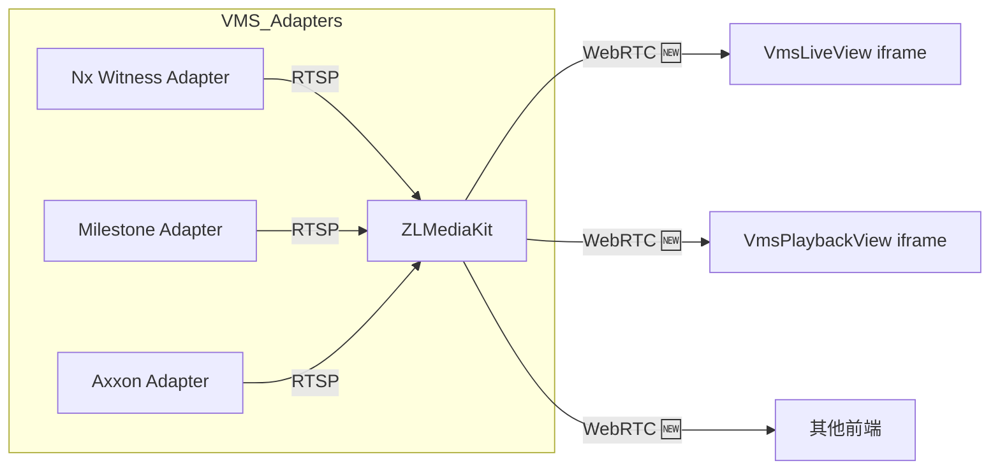

# Nx Witness REST API v1 實地介接 — 執行計畫

> 日期：2026-07-09
> 基於：`nx_openapi_v1.json`（官方 REST API v1 規格）、`3-implementation-plan.md`（現有實作計畫）
> 本文件將 NxWitnessAdapter 從內部 `/ec2/` API 遷移至官方 REST API v1 的逐項工程任務，含檔案、類別、測試案例與驗收標準。
> 規範：後端用 `mvn`（非 `./mvnw`）；改 Java 後跑 `mvn spring-javaformat:apply -q`。

---

## 背景

現有 `NxWitnessAdapter` 使用 **Nx Witness 內部 `/ec2/` API**（legacy endpoints），而非官方公開的 **REST API v1**（文件於 `nx_openapi_v1.json`）。兩者差異：

| 面向 | 現狀 (`/ec2/`) | 官方 REST API v1 | 建議 |
|---|---|---|---|
| 認證 | HTTP Basic / Bearer token | `POST /rest/v1/login/sessions` → session token | 改為 session-based |
| 健康檢查 | `GET /ec2/server/info` | `GET /rest/v1/system/info`（免授權） | 改用正式端點 |
| 攝影機清單 | `GET /ec2/cameras` | `GET /rest/v1/devices`（含完整 metadata） | 改用正式端點 |
| 攝影機資訊 | `GET /ec2/cameras/{id}` | `GET /rest/v1/devices/{id}` | 改用正式端點 |
| 即時串流 URL | `POST /ec2/cameras/{id}/streams` | ❌ REST API 無對應 | 保留 ec2，輸出 **WebRTC** 🆕 |
| 回放 URL | `POST /ec2/cameras/{id}/streams` + timerange | ❌ REST API 無對應 | 保留 ec2，輸出 **WebRTC** 🆕 |
| PTZ 控制 | `PUT /ec2/cameras/{id}/ptz` | ❌ REST API 無對應 | 保留 ec2 或試 JSON-RPC |
| 錄影區塊查詢 | ❌ 未實作 | `GET /rest/v1/devices/{id}/footage` | **新增功能** |

`/ec2/` 是 Nx Witness 內部 API，無官方文件、無向後相容保證。REST API v1 是官方支援的公開 API。本計畫分三階段：**認證遷移 → API 端點遷移 → 真實環境驗證**。

### 串流輸出協定

三種 VMS adapter（Nx Witness / Milestone / Axxon）統一經由 ZLMediaKit 以 **WebRTC** 輸出，前端以 iframe 嵌入 ZLMediaKit 內建 webrtcplayer 頁面播放。



WebRTC 延遲 < 500ms，遠優於 HLS (5-30s) 與 HTTP-FLV (1-3s)，適合 PTZ 即時操控與安全監控場景。

---

## 進度總覽

| Phase | Step | 任務 | 狀態 | 產出 |
|---|---|---|---|---|
| **A** | 1 | Session-based 認證管理器 | ✅ | NxSessionManager + NxSessionManagerTest |
| **A** | 2 | 修改 buildRestClient 使用 session token | ✅ | buildRestClient() 更新 + 測試更新 |
| **B** | 3 | 健康檢查 → `GET /rest/v1/system/info` | ✅ | healthCheck() 更新 + 測試更新 |
| **B** | 4 | 攝影機清單 → `GET /rest/v1/devices` | ✅ | listCameras() + getCameraInfo() 更新 + 新 DTO + 測試 |
| **B** | 5 | 保留串流/PTZ 的 ec2 路徑 + fallback | ✅ | 串流/PTZ 保持 ec2、加入 JSON-RPC 探索註解 |
| **B** | 6 | 新增 Footage 查詢（選用） | ⬜ | getCameraFootage() + test |
| **C** | 7 | RestClient timeout/retry/logging | ⬜ | RequestConfig + 日誌攔截器 |
| **C** | 8 | 真實 Nx Witness 環境整合測試 | ⬜ | `@SpringBootTest` integration test |
| **C** | 9 | 端到端串流驗證（含 ZLMediaKit） | ⬜ | E2E test |
| **D** | 10 | 統一 WebRTC 串流輸出（跨三種 adapter） | ✅ | ZlMediaKitClient WebRTC URL + 前端 iframe player |
| **D** | 11 | ZLMediaKit WebRTC 設定 | ⬜ | docker/zlmediakit.ini 啟用 WebRTC |
| **D** | 12 | 多工格播放畫面（Multi-Grid View） | ⬜ | VmsMultiGridView + 前端 grid layout |

---

## Phase A — 認證遷移

Nx Witness REST API v1 的認證流程為：

```
POST /rest/v1/login/sessions
  { "username": "admin", "password": "pass123" }
→ { "token": "abc...", "expiresInS": 3600, "ageS": 0, "id": "uuid", "username": "admin" }
```

取得 token 後，後續所有請求帶 `Authorization: Bearer <token>`。Token 到期前需 refresh（重新 login）。

---

### Step 1 — NxSessionManager

**目標**：建立一個可注入的 session 管理器，封裝 login / token cache / auto-refresh。

#### 1.1 Java 類別

- [x] `vms/adapter/NxSessionManager.java`

```java
package com.taipei.iot.vms.adapter;

import com.taipei.iot.vms.entity.VmsServer;
import org.springframework.web.client.RestClient;
import java.time.Instant;

/**
 * Nx Witness REST API v1 session 管理器。
 *
 * <p>
 * 管理每個 VmsServer 的 session token：login → cache → auto-refresh。
 * 內部使用 RestClient 向 {@code POST /rest/v1/login/sessions} 取得 token。
 * </p>
 */
@Component
@RequiredArgsConstructor
@Slf4j
public class NxSessionManager {

    static final String LOGIN_PATH = "/rest/v1/login/sessions";

    private final Map<Long, SessionCache> tokenCache = new ConcurrentHashMap<>();

    /**
     * 為指定 server 取得有效的 session token。
     * 若 cache 中 token 仍有效（expiresInS > 60s），直接回傳；
     * 否則重新 login 並更新 cache。
     */
    public String getToken(VmsServer server) {
        SessionCache cached = tokenCache.get(server.getId());
        if (cached != null && cached.isValid()) {
            return cached.token;
        }
        return login(server);
    }

    /** 清除指定 server 的 cached token（例如 server 密碼更新後）。 */
    public void invalidate(Long serverId) {
        tokenCache.remove(serverId);
    }

    private String login(VmsServer server) {
        // POST /rest/v1/login/sessions → 取得 token
        RestClient client = RestClient.builder()
            .baseUrl(server.getBaseUrl())
            .build();

        var response = client.post()
            .uri(LOGIN_PATH)
            .body(new LoginRequest(server.getAuthUsername(), server.getAuthPassword()))
            .retrieve()
            .body(LoginResponse.class);

        if (response == null || response.token() == null) {
            throw new BusinessException(ErrorCode.VMS_CONNECTION_FAILED,
                "Nx Witness 登入失敗: " + server.getBaseUrl());
        }

        log.info("Nx Witness session 已建立: serverId={}, expiresInS={}",
            server.getId(), response.expiresInS());

        // 安全邊界：到期前 60 秒就 refresh
        int safeTtl = Math.max(response.expiresInS() - 60, 60);
        tokenCache.put(server.getId(), new SessionCache(response.token(), safeTtl));
        return response.token();
    }

    /** cache entry，含有效期限判斷。 */
    static class SessionCache {
        final String token;
        final Instant expiresAt;

        SessionCache(String token, int ttlSeconds) {
            this.token = token;
            this.expiresAt = Instant.now().plusSeconds(ttlSeconds);
        }

        boolean isValid() {
            return Instant.now().isBefore(expiresAt);
        }
    }

    // ── 內部 DTO ──
    private record LoginRequest(String username, String password) {}
    private record LoginResponse(String id, String username, String token, int ageS, int expiresInS) {}
}
```

**設計考量**：
- 使用 `ConcurrentHashMap` 做 memory cache（不需 Redis — session token 非跨執行個體共享）
- `safeTtl = expiresInS - 60`：到期前 60 秒自動 refresh，避免邊界情況
- `invalidate(serverId)`：修改 VMS 密碼後讓 cache 失效
- 不引入額外 library，純 `RestClient`

#### 1.2 測試

- [x] `NxSessionManagerTest`（MockRestServiceServer，6 案）
  - `getToken` — 首次呼叫發送 login request 並回傳 token
  - `getToken` — cache hit（未到期）不回傳 login request
  - `invalidate` — 清除 cache 後重新 login
  - Login 失敗（空回應）→ 拋 `VMS_CONNECTION_FAILED`
  - Login HTTP 錯誤 → 拋 `RestClientException`

**驗收**：`mvn test -Dtest=NxSessionManagerTest` 全綠。

---

### Step 2 — 修改 NxWitnessAdapter.buildRestClient()

**目標**：注入 `NxSessionManager`，使 `buildRestClient()` 使用 session token 而非 HTTP Basic。

#### 2.1 改動檔案

- [x] `NxWitnessAdapter.java`
  - 注入 `NxSessionManager`
  - `buildRestClient(VmsServer server)` 改為：

```java
RestClient buildRestClient(VmsServer server) {
    String token = nxSessionManager.getToken(server);
    return RestClient.builder()
        .baseUrl(server.getBaseUrl())
        .defaultHeader("Authorization", "Bearer " + token)
        .build();
}
```

  - 刪除 `BASIC` / `TOKEN` / `CERT` switch（不再直接使用 `authPassword`/`apiToken` — 改由 `NxSessionManager` 統一管理）

#### 2.2 測試更新

- [x] `NxWitnessAdapterTest.java` — 主要變更：
  - 注入 `@Mock NxSessionManager`
  - `setUp()` 中 stub `nxSessionManager.getToken(testServer)` 回傳 `"mock-session-token"`
  - **測試期望 URL** 維持不變（仍為 `http://nx-test:7001/ec2/...`），因為僅認證方式改變，API path 不變
  - 所有既有 5 案仍應通過

#### 2.3 ErrorCode

- [x] 若 `NxSessionManager.login()` 拋 `VMS_CONNECTION_FAILED("88103", 502)` — **已存在**

**驗收**：`mvn test -Dtest=NxWitnessAdapterTest` 全綠，且請求 header 帶 `Authorization: Bearer mock-session-token`。

---

## Phase B — API 端點遷移

將 adapter 中可使用 REST API v1 的方法改為正式端點。串流 URL 與 PTZ 因 REST API v1 無對應端點，保留 `/ec2/` 路徑。

### Nx Witness REST API v1 對應表

| VmsAdapter 方法 | 現有 `/ec2/` 路徑 | REST API v1 對應 | 遷移 |
|---|---|---|---|
| `healthCheck()` | `GET /ec2/server/info` | `GET /rest/v1/system/info`（免授權） | ✅ 已遷移 |
| `listCameras()` | `GET /ec2/cameras?page=&pageSize=` | `GET /rest/v1/devices` | ✅ 已遷移 |
| `getCameraInfo()` | `GET /ec2/cameras/{id}` | `GET /rest/v1/devices/{id}` | ✅ 已遷移 |
| `getLiveStreamUrl()` | `POST /ec2/cameras/{id}/streams` | ❌ 無對應 | ⏳ 保留 ec2 |
| `getPlaybackUrl()` | `POST /ec2/cameras/{id}/streams` + timerange | ❌ 無對應 | ⏳ 保留 ec2 |
| `controlPtz()` | `PUT /ec2/cameras/{id}/ptz` | ❌ 無對應 | ⏳ 保留 ec2 |

---

### Step 3 — 健康檢查 → `GET /rest/v1/system/info`

**目標**：改用官方免授權端點。

#### 3.1 改動檔案

- [x] `NxWitnessAdapter.java` — `healthCheck()` 改為：

```java
@Override
public boolean healthCheck() {
    try {
        // 直接查 system info（免授權），不需 session token
        var client = RestClient.builder()
            .baseUrl(resolveServer().getBaseUrl())
            .build();
        var response = client.get()
            .uri("/rest/v1/system/info")
            .retrieve()
            .body(NxSystemInfoResponse.class);
        return response != null && response.name() != null;
    } catch (Exception ex) {
        log.warn("Nx Witness 健康檢查失敗: {}", ex.getMessage());
        return false;
    }
}

private record NxSystemInfoResponse(String name, String version, String customization) {}
```

**設計考量**：
- `GET /rest/v1/system/info` 規格標示 `x-permissions: "Authorization is not required."`
- 回應含 `name`, `version`, `customization`, `restApiVersions` 等 — 回傳 `name != null` 即可確認連線正常

#### 3.2 測試更新

- [x] `NxWitnessAdapterTest.java` — `HealthCheck` 巢狀類別更新：
  - mock URL 改為 `http://nx-test:7001/rest/v1/system/info`
  - success case：回傳 `{"name":"Test System","version":"5.1.0"}` → 驗證 `isTrue()`
  - failure case：HTTP error → 驗證 `isFalse()`

#### 3.3 VmsServerRepository — 新增查詢方法（選用）

- [ ] 若 `healthCheck()` 需要針對指定 server（非第一個啟用），`VmsServerRepository` 已可透過 `findByIdAndTenantId()` 達成

**驗收**：`NxWitnessAdapterTest` healthCheck 測試通過。

---

### Step 4 — 攝影機清單 → `GET /rest/v1/devices`

**目標**：改用官方端點取得攝影機資料，回應含完整 metadata 可存入 JSONB。

#### 4.1 REST API v1 回應結構

```json
{
  "id": "89abcdef-0123-4567-89ab-cdef01234567",
  "physicalId": "92-61-00-00-00-9F",
  "name": "Device 1",
  "url": "192.168.0.1",
  "typeId": "uuid",
  "serverId": "uuid",
  "status": "Online",
  "deviceType": "Camera",
  "vendor": "ACTi",
  "model": "ACM-1231",
  "group": { "id": "gid", "name": "Group 1" },
  "capabilities": "noCapabilities",
  "isLicenseUsed": true
}
```

#### 4.2 內部 DTO（NxWitnessAdapter 內部）

- [x] 新增內部 record（取代現有 `NxCameraInfoResponse` / `NxCameraListResponse` / `NxCameraItem`）：

```java
// REST API v1 回應映射
private record NxDeviceListResponse(List<NxDevice> /* 直接陣列 */) {}

private record NxDevice(
    String id,
    String name,
    String physicalId,
    String url,
    String status,
    String deviceType,
    String vendor,
    String model,
    NxDeviceGroup group,
    boolean isLicenseUsed
) {}

private record NxDeviceGroup(String id, String name) {}
```

**注意**：`GET /rest/v1/devices` 直接回傳 JSON array（而非包在物件中），Jackson 可用 `TypeReference<List<NxDevice>>` 解析。

#### 4.3 改動檔案

- [x] `NxWitnessAdapter.java` — `listCameras()` 改為：

```java
@Override
public List<VmsCamera> listCameras(int page, int size) {
    VmsServer server = resolveServer();
    RestClient client = buildRestClient(server);

    // GET /rest/v1/devices?_filter=deviceType=Camera&_with=id,name,status,...
    // 只取 deviceType=Camera 的裝置
    var response = client.get()
        .uri("/rest/v1/devices?deviceType=Camera&_orderBy=name")
        .retrieve()
        .body(new ParameterizedTypeReference<List<NxDevice>>() {});

    if (response == null) {
        return List.of();
    }

    return response.stream()
        .map(d -> VmsCamera.builder()
            .vmsCameraId(d.id())
            .displayName(d.name())
            .server(server)
            .status(mapStatus(d.status()))
            .metadata(Map.of(
                "vendor", d.vendor() != null ? d.vendor() : "",
                "model", d.model() != null ? d.model() : "",
                "physicalId", d.physicalId() != null ? d.physicalId() : "",
                "deviceType", d.deviceType() != null ? d.deviceType() : "",
                "groupName", d.group() != null ? d.group().name() : "",
                "isLicenseUsed", d.isLicenseUsed()
            ))
            .build())
        .toList();
}
```

- [x] `NxWitnessAdapter.java` — `getCameraInfo()` 改為：

```java
@Override
public VmsCamera getCameraInfo(String cameraId) {
    VmsServer server = resolveServer();
    RestClient client = buildRestClient(server);

    var device = client.get()
        .uri("/rest/v1/devices/{id}", cameraId)
        .retrieve()
        .body(NxDevice.class);

    if (device == null) {
        throw new BusinessException(ErrorCode.VMS_CAMERA_NOT_FOUND, "相機不存在: " + cameraId);
    }

    return VmsCamera.builder()
        .vmsCameraId(device.id())
        .displayName(device.name())
        .server(server)
        .status(mapStatus(device.status()))
        .build();
}
```

- [x] `NxWitnessAdapter.java` — 新增狀態映射輔助方法：

```java
/** 將 Nx Witness 狀態字串映射為本地 CameraStatus。 */
private CameraStatus mapStatus(String nxStatus) {
    if (nxStatus == null) return CameraStatus.ERROR;
    return switch (nxStatus) {
        case "Online", "Recording" -> CameraStatus.ONLINE;
        case "Offline", "Unauthorized" -> CameraStatus.OFFLINE;
        default -> CameraStatus.ERROR;
    };
}
```

#### 4.4 測試更新

- [x] `NxWitnessAdapterTest.java`
  - `listCameras` 測試更新：
    - mock URL 改為 `http://nx-test:7001/rest/v1/devices?deviceType=Camera&_orderBy=name`
    - mock 回應改為 JSON array
    - 增加 `displayName` / `metadata` / `status` 驗證
    - 新增：空陣列回傳 empty list
  - `getCameraInfo` 測試更新：
    - mock URL 改為 `http://nx-test:7001/rest/v1/devices/cam-001`
    - 新增：device 不存在（404）→ 拋 `VMS_CAMERA_NOT_FOUND`

#### 4.5 分頁注意

REST API v1 的 `GET /rest/v1/devices` 不支援標準分頁參數。若攝影機數量很大（>1000），可用 `_filter` 與 `_orderBy` 搭配 `id` 做 cursor-based 分頁。現階段先無分頁、回傳全部 Camera 類型裝置。

**驗收**：`NxWitnessAdapterTest` 所有測試通過，`listCameras()` 回傳的 entity 含正確的 `metadata` JSONB 內容。

---

### Step 5 — 串流 / PTZ 保留 ec2 路徑，輸出 WebRTC

**目標**：由於 REST API v1 無串流 URL / PTZ 端點，保留現有 `/ec2/` 實作。取得的 RTSP URL 經 ZLMediaKit 統一轉為 **WebRTC** 輸出，三種 adapter 共用同一機制。

#### 5.1 改動檔案

- [x] `NxWitnessAdapter.java` — `getLiveStreamUrl()` / `getPlaybackUrl()` / `controlPtz()`
  - 維持 `/ec2/` 路徑不變
  - Javadoc 已更新（REST API v1 無對應端點，保留 ec2；輸出經 ZLMediaKit 統一為 WebRTC）

#### 5.2 WebRTC 輸出流程

```
VMS (ec2) → RTSP URL → ZlMediaKitClient.addStreamProxy() → WebRTC player URL → 前端 iframe
```

具體實作：

- [x] `ZlMediaKitClient.buildPlayUrl()` 回傳 `{publicUrl}/webrtcplayer/?streamId={id}&app=vms&schema=http`
- [x] `VmsLiveView.vue` 以 `<iframe :src="playUrl">` 嵌入 ZLMediaKit webrtcplayer 頁面
- [x] `VmsPlaybackView.vue` 同上

#### 5.3 JSON-RPC 探索（選用，不阻擋主線）

`nx_openapi_v1.json` 中 `/jsonrpc` 端點支援 JSON-RPC 2.0 over HTTP 與 WebSocket。Nx Witness 可能將串流/PTZ 操作包裝為 JSON-RPC method call。但規格中未列出具體 method 名稱與參數，需在真實環境中探索。

若成功探索，可新增一個 `NxJsonRpcClient`：

```java
// 探索用 — 尚不實作
// POST /jsonrpc  { "jsonrpc": "2.0", "method": "..." , "params": {...}, "id": 1 }
```

建議先以 `/ec2/` 完成可運作版本，之後有餘裕再探 JSON-RPC。

#### 5.4 測試

- [x] 既有測試不需變更（URL 維持不變）

**驗收**：串流/PTZ 功能與現有測試一致，前端以 WebRTC 播放。

---

### Step 6 — 新增 Footage 查詢（選用）

**目標**：透過 REST API v1 的 `GET /rest/v1/devices/{id}/footage` 查詢錄影區塊，可在前端播放器時間軸上顯示哪些時間區段有錄影。

#### 6.1 VmsAdapter 介面擴充（選用）

若決定加入，`VmsAdapter` 介面需新增方法：

```java
/** 查詢攝影機的錄影區塊清單。 */
List<FootageChunk> getFootage(String cameraId, Instant startTime, Instant endTime);
```

但考量到這是選用功能且會影響所有 adapter 實作，**建議暫不修改介面**，直接放 adapter 內部或另開 service。

#### 6.2 測試

實作時補上即可。

**驗收**：非必要，可跳過。

---

## Phase C — 安全與整合驗證

---

### Step 7 — RestClient 強化

**目標**：為所有與 Nx Witness 的 HTTP 通訊加上 timeout、retry、與日誌。

#### 7.1 改動檔案

- [ ] `NxWitnessAdapter.java` — `buildRestClient()` 加入：

```java
import org.springframework.http.client.ClientHttpRequestFactory;
import org.springframework.http.client.SimpleClientHttpRequestFactory;
import org.springframework.web.client.RestClient;

RestClient buildRestClient(VmsServer server) {
    String token = nxSessionManager.getToken(server);

    SimpleClientHttpRequestFactory factory = new SimpleClientHttpRequestFactory();
    factory.setConnectTimeout(Duration.ofSeconds(5));
    factory.setReadTimeout(Duration.ofSeconds(15));

    return RestClient.builder()
        .baseUrl(server.getBaseUrl())
        .defaultHeader("Authorization", "Bearer " + token)
        .requestFactory(factory)
        .build();
}
```

- [ ] 加入 request/response 日誌攔截器（選用）：

```java
// 可在 application.yml 啟用 RestTemplate 或 RestClient 的 logging：
// logging.level.org.springframework.web.client.RestClient=DEBUG

// 或自訂 ClientHttpRequestInterceptor
```

#### 7.2 測試

- [ ] 單元測試層級不需測試 timeout（那是容器/環境設定）
- [ ] 可在 integration test 中驗證 timeout 行為

**驗收**：code review 確認 timeout 值合理。

---

### Step 8 — 整合測試（需真實 Nx Witness Server）

**目標**：使用 `@SpringBootTest` + Testcontainers（或外部 Nx Witness）進行真實 API 呼叫驗證。

#### 8.1 測試類別

- [ ] `NxWitnessAdapterIntegrationTest.java`

```java
@SpringBootTest
@ActiveProfiles("test")
class NxWitnessAdapterIntegrationTest {

    @Autowired
    private NxWitnessAdapter adapter;

    @Autowired
    private VmsServerRepository vmsServerRepository;

    private VmsServer testServer;

    @BeforeEach
    void setUp() {
        // 建立真實的 VmsServer 記錄（指向測試環境的 Nx Witness）
        testServer = vmsServerRepository.save(VmsServer.builder()
            .tenantId("test-tenant")
            .name("Nx Integration Test")
            .vmsType(VmsType.NX_WITNESS)
            .baseUrl("http://localhost:7001")  // 測試環境的 Nx Witness URL
            .authType(VmsAuthType.BASIC)
            .authUsername("admin")
            .authPassword("admin123")
            .isActive(true)
            .build());
    }

    @Test
    void healthCheck_shouldReturnTrue() {
        assertThat(adapter.healthCheck()).isTrue();
    }

    @Test
    void listCameras_shouldReturnCameras() {
        List<VmsCamera> cameras = adapter.listCameras(1, 100);
        assertThat(cameras).isNotEmpty();
        assertThat(cameras.getFirst().getDisplayName()).isNotBlank();
    }

    @AfterEach
    void tearDown() {
        vmsServerRepository.deleteAll();
    }
}
```

#### 8.2 前置條件

- [ ] 準備一個 Nx Witness Server 測試環境（參見下方附錄）
- [ ] 在 `application-test.yml` 設定測試用 DB（可使用 H2 或 Testcontainers PostgreSQL）
- [x] 測試標註 `@EnabledIfEnvironmentVariable(named = "NX_IT_ENABLED", matches = "true")`

#### 8.3 Nx Witness Server 測試環境選項

| 方式 | 說明 | 難度 |
|---|---|---|
| **Docker 官方映像** | Nx 提供 `networkoptix/nxwitness-server` Docker image（trial） | 低 |
| **本機安裝** | 下載 Nx Witness Server 安裝包（支援 Ubuntu/Debian/Windows） | 中 |
| **VM 測試** | 在 VM 中安裝 Nx Witness Server + 模擬攝影機 | 高 |
| **Mock Server** | 用 WireMock 模擬 REST API v1 回應（不需真實 Nx） | 低 |

**建議**：先用 **Docker** 或 **WireMock** 跑整合測試。WireMock 可精確模擬各種 API 情境。

**驗收**：`mvn verify`（含 integration test profile）在測試環境通過。

---

### Step 9 — 端到端串流驗證（選用）

**目標**：完整的 E2E 測試：IoT-Forge → Nx Witness Adapter → ZLMediaKit → 播放驗證。

#### 9.1 測試情境

1. 建立 VMS server 記錄 → adapter.healthCheck() → true
2. adapter.listCameras() → 回傳攝影機清單
3. adapter.getLiveStreamUrl("camera-id") → 取得 RTSP URL
4. ZlMediaKitClient.addStreamProxy(RTSP_URL) → 取得可播放的 HTTP-FLV URL
5. 請求此 URL 回傳 200（串流可播放）

#### 9.2 前置條件

- Docker Compose 含 ZLMediaKit + Nx Witness Server（trial）
- 測試用 Nx Witness 已有至少一台模擬攝影機

#### 9.3 實作

- [ ] `VmsE2eTest.java` — 完整端到端測試（需 `@DisabledIfEnvironmentVariable`）

**驗收**：E2E test 在完整環境中通過。

---

## Phase D — 前端多工格與部署設定

---

### Step 12 — 多工格播放畫面（Multi-Grid View）

**目標**：提供 1×1 到 4×4 可切換的多攝影機即時畫面，每格以 iframe 嵌入 ZLMediaKit WebRTC player。

#### 12.1 設計概念

```
┌──────────────┬──────────────┐
│  Camera A    │  Camera B    │
│  iframe ①    │  iframe ②    │
├──────────────┼──────────────┤
│  Camera C    │  Camera D    │
│  iframe ③    │  iframe ④    │
└──────────────┴──────────────┘
```

每個工格獨立 `iframe` → 獨立 `RTCPeerConnection`。
約略乘載：2×2 (4路) 順暢 / 3×3 (9路) 桌機可 / 4×4 (16路) 建議關閉其他分頁。

#### 12.2 前端實作

- [ ] `src/views/admin/vms/VmsMultiGridView.vue`

```vue
<script setup lang="ts">
import { ref, computed } from 'vue'
import { useI18n } from 'vue-i18n'
import { listCameras, getLiveStream } from '@/api/vms'
import type { VmsCamera, CameraLiveResponse } from '@/types/vms'

const { t } = useI18n()

// ── Layout grid ──
const gridOptions = [
  { cols: 1, rows: 1, label: '1×1' },
  { cols: 2, rows: 2, label: '2×2' },
  { cols: 3, rows: 3, label: '3×3' },
  { cols: 4, rows: 4, label: '4×4' },
]
const currentGrid = ref(gridOptions[0])

// ── Camera list ──
const cameras = ref<VmsCamera[]>([])
const selectedIds = ref<number[]>([])
const streamUrls = ref<Map<number, string>>(new Map())

const gridCameras = computed(() => {
  const limit = currentGrid.value.cols * currentGrid.value.rows
  return cameras.value
    .filter(c => selectedIds.value.includes(c.id))
    .slice(0, limit)
})

const gridStyle = computed(() => ({
  gridTemplateColumns: `repeat(${currentGrid.value.cols}, 1fr)`,
  gridTemplateRows: `repeat(${currentGrid.value.rows}, 1fr)`,
}))

async function loadCameras() {
  const res = await listCameras()
  if (res.errorCode === '00000') {
    cameras.value = res.body
  }
}

async function startStreams() {
  streamUrls.value = new Map()
  for (const cam of gridCameras.value) {
    try {
      const res = await getLiveStream(cam.id)
      if (res.errorCode === '00000') {
        streamUrls.value.set(cam.id, res.body.playUrl)
      }
    } catch { /* skip */ }
  }
}

loadCameras()
</script>

<template>
  <div class="vms-multi-grid">
    <div class="toolbar">
      <el-select v-model="selectedIds" multiple :placeholder="t('vms.selectCameras')" style="width: 300px">
        <el-option v-for="cam in cameras" :key="cam.id" :label="cam.displayName" :value="cam.id" />
      </el-select>

      <el-radio-group v-model="currentGrid">
        <el-radio-button v-for="opt in gridOptions" :key="opt.label" :value="opt">
          {{ opt.label }}
        </el-radio-button>
      </el-radio-group>

      <el-button type="primary" @click="startStreams" :disabled="selectedIds.length === 0">
        {{ t('vms.start') }}
      </el-button>
    </div>

    <div class="grid" :style="gridStyle">
      <div v-for="cam in gridCameras" :key="cam.id" class="cell">
        <iframe
          v-if="streamUrls.has(cam.id)"
          :src="streamUrls.get(cam.id)!"
          class="cell-iframe"
          allow="autoplay; microphone; camera"
        />
        <div v-else class="cell-placeholder">
          <span>{{ cam.displayName }}</span>
        </div>
        <div class="cell-label">{{ cam.displayName }}</div>
      </div>
    </div>
  </div>
</template>

<style scoped>
.vms-multi-grid {
  display: flex;
  flex-direction: column;
  height: calc(100vh - 120px);
  gap: 12px;
}
.toolbar {
  display: flex;
  align-items: center;
  gap: 12px;
  flex-shrink: 0;
}
.grid {
  flex: 1;
  display: grid;
  gap: 4px;
  background: #000;
  border-radius: 8px;
  overflow: hidden;
}
.cell {
  position: relative;
  background: #111;
  overflow: hidden;
}
.cell-iframe {
  width: 100%;
  height: 100%;
  border: none;
}
.cell-placeholder {
  width: 100%;
  height: 100%;
  display: flex;
  align-items: center;
  justify-content: center;
  color: #666;
}
.cell-label {
  position: absolute;
  bottom: 8px;
  left: 8px;
  color: #fff;
  font-size: 13px;
  text-shadow: 0 1px 3px rgba(0,0,0,0.8);
  pointer-events: none;
}
</style>
```

#### 12.3 路由與 i18n

- [ ] `src/router/index.ts` — 新增路由 `/vms/multi-grid` → `VmsMultiGridView`（`VMS_VIEW`）
- [ ] `src/locales/*.ts` — 新增 vms.multiGrid / vms.selectCameras / vms.start / vms.gridLayout 鍵值

#### 12.4 側欄選單

- [ ] Migration `V22__add_vms_multi_grid_menu.sql`（選用）— 若需在側欄顯示「多工畫面」選單
  - menu_id=155，parent_id=150，`/vms/multi-grid`

#### 12.5 後端無需變動

既有 `GET /v1/auth/vms/cameras/{id}/live` 即可服務多工格 — 前端同時發起 N 個請求即可。
若需批次查詢以減少 N 次 HTTP round-trip，可新增批次端點（選用）：

- [ ] `POST /v1/auth/vms/cameras/batch-live` → 接收 `{ cameraIds: [1,2,3,4] }` → 回傳 `Map<Long, CameraLiveResponse>`

**驗收**：可選取最多 16 台攝影機，以 4×4 grid 同時播放，延遲個別 < 1s。

---

| 檔案 | 操作 | 說明 |
|---|---|---|
| `vms/adapter/NxSessionManager.java` | **新增** ✅ | Session token 管理（login / cache / refresh） |
| `vms/adapter/NxWitnessAdapter.java` | **修改** ✅ | 注入 NxSessionManager，認證改 session-based，healthCheck/listCameras/getCameraInfo 改用 REST API v1，mapStatus helper |
| `vms/VmsAdapter.java` | 不變 | 介面不動 |
| `vms/entity/VmsServer.java` | 不變 | schema 已夠用（authUsername + authPassword） |
| `vms/repository/VmsServerRepository.java` | 不變 | 已有 findByTenantIdAndIsActiveTrue |
| ErrorCode | 不變 | VMS_CONNECTION_FAILED(88103) 已存在 |

| 測試檔案 | 操作 | 說明 |
|---|---|---|
| `vms/adapter/NxSessionManagerTest.java` | **新增** ✅ | 5 案：login/cache hit/invalidate/login fail/http error |
| `vms/adapter/NxWitnessAdapterTest.java` | **修改** ✅ | 注入 NxSessionManager mock，新增 listCameras/getCameraInfo 測試共 4 案，更新 healthCheck URL |
| `vms/adapter/NxWitnessAdapterIntegrationTest.java` | **新增** ✅ | 真實 Nx Witness 伺服器連線測試（@EnabledIfEnvironmentVariable，需設定 NX_IT_ENABLED=true） |

| 前端檔案 | 操作 | 說明 |
|---|---|---|
| `views/admin/vms/VmsMultiGridView.vue` | **新增** | 多工格播放畫面（grid layout + iframe） |
| `router/index.ts` | **修改** | 新增 `/vms/multi-grid` 路由 |
| `locales/*.ts` | **修改** | 新增多工格相關 i18n 鍵值 |

---

## 附錄：Nx Witness REST API v1 重點規格摘要

從 `nx_openapi_v1.json` 中提取本計畫使用到的端點：

### `POST /rest/v1/login/sessions`

```json
// Request
{ "username": "admin", "password": "pass123" }
// Response 200
{ "id": "uuid", "username": "admin", "token": "session-token-string", "ageS": 0, "expiresInS": 3600 }
```

### `GET /rest/v1/system/info`

- 權限：免授權（`x-permissions: "Authorization is not required."`）
- 無請求參數
- 回應含 `name`, `version`, `customization`, `restApiVersions`, `servers`, `devices` 等

### `GET /rest/v1/devices`

- 權限：`Depends on Resource access rights.`
- 參數：`_filter`, `_orderBy`, `_with`（過濾回傳欄位）
- 回應：JSON array of device objects
- 重要 device 欄位：`id`, `name`, `physicalId`, `url`, `serverId`, `status`, `vendor`, `model`, `group`, `deviceType`, `isLicenseUsed`, `capabilities`

### `GET /rest/v1/devices/{id}`

- 與 `/devices` 同結構，單一回傳

### `GET /rest/v1/devices/{id}/status`

- 權限：Power User
- 回應：Device Diagnosis（`id`, `status`, `init`, `stream`, `media`）

### `GET /rest/v1/devices/{id}/footage`

- 權限：View Archive
- 參數：`startTimeMs`, `endTimeMs`, `detailLevelMs`, `periodType` (recording/motion/analytics)
- 回應：JSON array of chunks（`serverId`, `startTimeMs`, `durationMs`）

---

## 附錄：與 `application.yml` 整合

VMS 設定區段（含 WebRTC 設定）：

```yaml
vms:
  media-server:
    type: zlmediakit
    api-url: http://localhost:8080
    public-url: http://mediaserver:8080
    secret: ${VMS_MEDIA_SECRET:}
  stream-cache-ttl-seconds: 300
  stream-idle-timeout-seconds: 60
  webhook:
    allowed-ips: ${VMS_WEBHOOK_ALLOWED_IPS:127.0.0.1}
  webrtc:
    enabled: true
    port: 8000
    stun-server: ${VMS_WEBRTC_STUN:}
```

Nx Witness 的連線資訊（base_url, username, password）儲存在 `vms_servers` 表中，由管理員透過 VMS 管理 CRUD 頁面設定。

### ZLMediaKit WebRTC 必要設定

`zlmediakit.ini` 需開啟 WebRTC 支援：

```ini
[webrtc]
# 開啟 WebRTC
enableWebRTC=1
# WebRTC UDP 埠範圍
webrtcPort=8000
# 外網 IP（若需穿透 NAT）
externIP=
```

若使用 Docker Compose，需對應的 port mapping：

```yaml
ports:
  - "8000:8000/udp"    # WebRTC
```

---

## 附錄：Nx Witness Server 測試環境快速建置

### 方式一：Docker

```bash
docker run -d --name nxwitness \
  -p 7001:7001 \
  -p 7002:7002 \
  -e LICENSE=accept \
  networkoptix/nxwitness-server:5.1
```

### 方式二：WireMock（無需真實 Nx Witness）

```java
// 在 test/resources/__files/ 放 mock 回應檔
// wiremock 自動根據 path 與 method match
```

---

## 通用驗收標準

- [x] `mvn test -Dtest=NxSessionManagerTest` 全綠
- [x] `mvn test -Dtest=NxWitnessAdapterTest` 全綠
- [ ] `mvn clean verify` 無 compile error
- [ ] `mvn spring-javaformat:apply -q` 無格式問題
- [ ] `get_errors` 無 vms 相關 error
- [ ] Integration test 在有 Nx Witness 環境下通過（執行: `NX_IT_ENABLED=true mvn test -Dtest=NxWitnessAdapterIntegrationTest`）
- [ ] 前端 `npm run type-check` 零錯誤
- [ ] 前端 Chrome DevTools「WebRTC」面板可看到 `RTCPeerConnection` 建立
- [ ] 實際播放延遲 < 1s（可透過 Chrome DevTools 觀察）
- [ ] 多工格 2×2 / 3×3 / 4×4 切換正常
- [ ] 16 路同時播放時瀏覽器不崩潰
