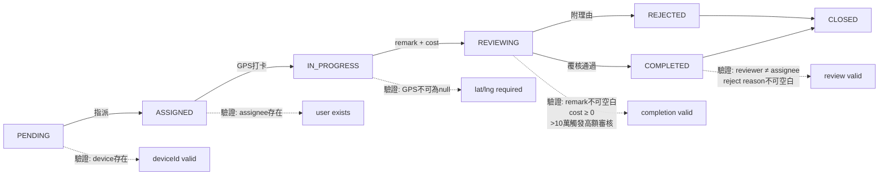

> 工單管理, 最小功能應該要有哪些必須驗證

Read [](file:///home/kevin/workspaces/kevin-projects/CodeCortex/backend/src/main/java/com/taipei/iot/device/entity/WorkOrder.java#1-1), lines 1 to 120

Read [](file:///home/kevin/workspaces/kevin-projects/CodeCortex/backend/src/main/java/com/taipei/iot/device/entity/WorkOrder.java#120-120), lines 120 to 179

Read [](file:///home/kevin/workspaces/kevin-projects/CodeCortex/backend/src/main/java/com/taipei/iot/device/enums/WorkOrderStatus.java)

Read [](file:///home/kevin/workspaces/kevin-projects/CodeCortex/backend/src/main/java/com/taipei/iot/device/enums/WorkOrderSourceType.java)

Searched for files matching `**/device/service/WorkOrderService.java`, 1 match

Read [](file:///home/kevin/workspaces/kevin-projects/CodeCortex/backend/src/main/java/com/taipei/iot/device/service/WorkOrderService.java#1-1), lines 1 to 250

已經完整看完現有實作。以下是分析：

---

## 現有狀態流程

```
PENDING → ASSIGNED → IN_PROGRESS → REVIEWING → COMPLETED → CLOSED
                                                → REJECTED → CLOSED
```

目前 Service 層有**基本狀態轉移檢查**（`assertStatus`），但有多處驗證缺口：

---

## 必須補上的驗證

### 1️⃣ 建立工單（create）

| 驗證 | 原因 |
|---|---|
| `deviceId` 必須存在 | `Device` 被刪除時工單會變孤兒 |
| `orderType` 應有 enum 白名單 | 目前是 `String`，拼錯字也不報錯 |
| `sourceType` 轉 enum 要防呆 | `valueOf()` 失敗會拋 `IllegalArgumentException` 而非業務錯誤 |

### 2️⃣ 指派（assign）

| 驗證 | 原因 |
|---|---|
| `assigneeUserId` 必須存在 | 指派給不存在的 user 無法追蹤 |
| 不可重複指派 | ✅ **已有** |

### 3️⃣ 到場打卡（startWork）

| 驗證 | 原因 |
|---|---|
| GPS 座標 `latitude` / `longitude` 不可為 null | 打卡若無位置等同沒到場證明 |

### 4️⃣ 完成維修（complete）

| 驗證 | 原因 |
|---|---|
| `completionRemark` 不可空白 | 維修完成必須有紀錄 |
| `repairCost` 不可為負數 | 金額合理性 |
| 費用 > 10 萬需特殊審核 | 程式碼有 `EXPENSIVE_THRESHOLD` 常數但**完全沒用到** |

### 5️⃣ 覆核（approve / reject）

| 驗證 | 原因 |
|---|---|
| `reviewerId` 不可與 `assignedTo` 相同 | 球員兼裁判，違反職能分離 |
| `reject()` 的 `reason` 不可空白 | 駁回必須附理由 |

### 6️⃣ 結案（close）

| 驗證 | 原因 |
|---|---|
| ✅ **已有** — 僅 COMPLETED / REJECTED 可結案 | — |

---

## 流程圖（含驗證點）



---

要開始補這些驗證嗎？我可以一次補完所有 `WorkOrderService` 的檢查邏輯，包含 `EXPENSIVE_THRESHOLD` 高額審核流程。