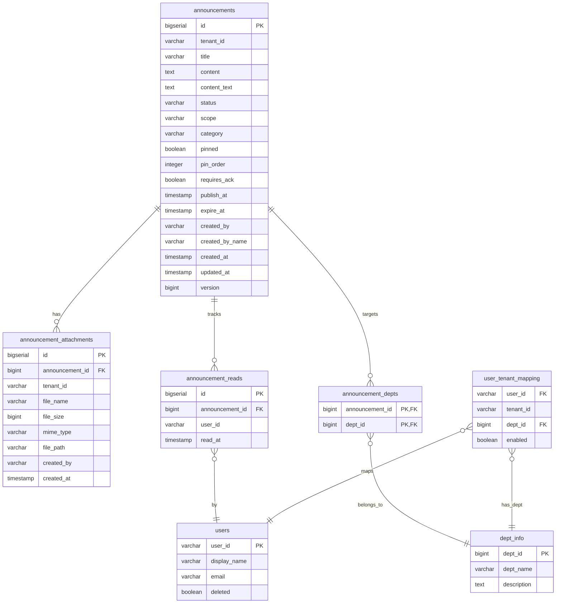

## 📊 公告模組 ER Model（不含翻譯表）

根據你提供的四個 SQL 表結構檔案（`announcements`、`announcement_attachments`、`announcement_depts`、`announcement_reads`），重新建立完整的 **ER Model（實體關係模型）**：

---

### 實體清單

| 實體名稱 | 說明 |
|---------|------|
| **announcements** | 公告主表，儲存公告內容與元資料（標題、內容、狀態、範圍、分類、置頂、發布/過期時間等） |
| **announcement_attachments** | 公告附件元資料表（實際檔案儲存於檔案系統） |
| **announcement_depts** | 公告與部門關聯表（多對多中介表） |
| **announcement_reads** | 公告閱讀記錄表（使用者閱讀行為追蹤） |
| **dept_info** | 部門資訊表（外部參考，由組織模組提供） |
| **users** | 使用者主表（外部參考） |
| **user_tenant_mapping** | 使用者與租戶對應表（外部參考，含部門綁定與啟用狀態） |

> 註：`dept_info`、`users`、`user_tenant_mapping` 為外部系統表，在此僅標示關聯方向，不屬於公告模組管理範圍。

---

### 實體關係圖（文字版）


```
┌─────────────────────────────────────────────────────────────────────────────────┐
│                                                                                                                                                                  │
│  ┌───────────────────────┐                    ┌──────────────────────────────────────────┐  │
│  │     announcements                            │                    │         announcement_attachments                                                   │  │
│  ├───────────────────────┤                    ├──────────────────────────────────────────┤  │
│  │ id (PK)                                      │◄─────────┤ announcement_id (FK)                                                               │  │
│  │ tenant_id                                    │       1 : N        │ id (PK)                                                                            │  │
│  │ title                                        │                    │ tenant_id                                                                          │  │
│  │ content                                      │                    │ file_name                                                                          │  │
│  │ content_text                                 │                    │ file_size                                                                          │  │
│  │ status                                       │                    │ mime_type                                                                          │  │
│  │ scope                                        │                    │ file_path                                                                          │  │
│  │ category                                     │                    │ created_by                                                                         │  │
│  │ pinned                                       │                    │ created_at                                                                         │  │
│  │ pin_order                                    │                    └──────────────────────────────────────────┘  │
│  │ requires_ack                                 │                                                                                                              │
│  │ publish_at                                   │                    ┌──────────────────────────────────────────┐  │
│  │ expire_at                                    │◄─────────┤            announcement_reads                                                      │  │
│  │ created_by                                   │       1 : N        ├──────────────────────────────────────────┤  │
│  │ created_by_name                              │                    │ announcement_id (FK)                                                               │  │
│  │ created_at                                   │                    │ id (PK)                                                                            │  │
│  │ updated_at                                   │                    │ user_id                                                                            │  │
│  │ version                                      │                    │ read_at                                                                            │  │
│  └──────────┬────────────┘                    └──────────────────────────────────────────┘  │
│             │                                                                                                                                                   │
│             │ 1 : N (透過關聯表)                                      ┌──────────────────────────────────────────┐  │
│             ▼                                                         │                                                                                    │  │
│  ┌───────────────────────┐                    │                ※ 說明 ※                                                          │  │
│  │  announcement_depts                          │                    │                                                                                    │  │
│  ├───────────────────────┤                    │  無獨立翻譯表。                                                                    │  │
│  │ announcement_id(PK,FK)                       │                    │  多語系由主表 title / content                                                      │  │
│  │ dept_id (PK, FK)                             │                    │  作為預設語言 (zh-TW)。                                                            │  │
│  └──────────┬────────────┘                    │                                                                                    │  │
│             │                                                         └──────────────────────────────────────────┘  │
│             ▼                                                                                                                                                   │
│  ┌───────────────────────┐                                                                                                              │
│  │       dept_info                              │                                                                                                              │
│  ├───────────────────────┤                                                                                                              │
│  │ dept_id (PK)                                 │◄────────────────────────────────────────────────────┐  │
│  │ dept_name                                    │                                                                                                          │  │
│  │ ...                                          │                                                                                                          │  │
│  └───────────────────────┘                                                                                                          │  │
│                                                                                                                                                              │  │
│  ── 外部關聯（統計查詢用）───────────────────────────────────────────────────────────────   │  │
│                                                                                                                                                              │  │
│  ┌───────────────────────┐                    ┌──────────────────────────────────────────┐  │
│  │         users                                │                    │           user_tenant_mapping                                                      │  │
│  ├───────────────────────┤                    ├──────────────────────────────────────────┤  │
│  │ user_id (PK)                                 │◄─────────┤ user_id (FK)                                                                       │  │
│  │ display_name                                 │       1 : N        │ tenant_id                                                                          │  │
│  │ email                                        │                    │ dept_id (FK)               ────────────────────────────┘  │
│  │ deleted                                      │                    │ enabled                                                                            │  │
│  └───────────────────────┘                    └──────────────────────────────────────────┘  │
│                                                                                             │
└─────────────────────────────────────────────────────────────────────────────────┘
```


### 詳細實體關係說明

#### 1. `announcements` ←→ `announcement_attachments`（一對多）
- **關係**：一則公告可有多個附件
- **外鍵**：`announcement_attachments.announcement_id` → `announcements.id`
- **級聯刪除**：`ON DELETE CASCADE`（刪除公告時自動刪除所有附件記錄）
- **實際檔案**：儲存於 `./uploads/announcement/{announcementId}/`

#### 2. `announcements` ←→ `announcement_reads`（一對多）
- **關係**：一則公告可被多位使用者閱讀
- **外鍵**：`announcement_reads.announcement_id` → `announcements.id`
- **級聯刪除**：`ON DELETE CASCADE`
- **唯一約束**：`(announcement_id, user_id)` 確保同一使用者對同一公告僅有一筆記錄（冪等）

#### 3. `announcements` ←→ `announcement_depts`（一對多，多對多中介）
- **關係**：一則公告可發送給多個部門；一部門可收到多則公告（多對多）
- **中介表**：`announcement_depts` 使用複合主鍵 `(announcement_id, dept_id)`
- **外鍵**：
  - `announcement_depts.announcement_id` → `announcements.id`（`ON DELETE CASCADE`）
  - `announcement_depts.dept_id` → `dept_info.dept_id`
- **用途**：`scope = 'DEPT'` 時，指定可見部門清單

#### 4. `announcement_depts` ←→ `dept_info`（多對一）
- **關係**：多個關聯記錄指向同一部門
- **外鍵**：`announcement_depts.dept_id` → `dept_info.dept_id`

#### 5. `announcement_reads` ←→ `users`（多對一）
- **關係**：多筆閱讀記錄指向同一使用者
- **隱含關聯**：`announcement_reads.user_id` → `users.user_id`（無明確 FK，但有索引）

#### 6. `user_tenant_mapping` ←→ `users`（多對一）
- **關係**：單一使用者可在多個租戶中啟用
- **用途**：統計查詢時用於篩選「有效使用者」（`enabled = true` 且 `users.deleted = false`）

---

### 索引設計一覽

| 表 | 索引名稱 | 欄位 | 類型/條件 | 用途 |
|----|---------|------|----------|------|
| `announcements` | `idx_announcements_tenant_id` | `tenant_id` | B-tree | 租戶隔離查詢 |
| `announcements` | `idx_announcements_status` | `tenant_id, status, publish_at DESC` | B-tree | 管理端依狀態篩選列表 |
| `announcements` | `idx_announcements_published_active` | `tenant_id, scope, publish_at, expire_at` | B-tree, WHERE `status='PUBLISHED'` | 前台可見公告查詢（核心效能） |
| `announcements` | `idx_announcements_category_publish` | `category, publish_at DESC` | B-tree, WHERE `status='PUBLISHED'` | 前台分類過濾 |
| `announcements` | `idx_announcements_pin_order` | `tenant_id, pin_order` | B-tree, WHERE `pinned=true AND pin_order IS NOT NULL` | 置頂排序查詢 |
| `announcements` | `idx_announcements_requires_ack` | `tenant_id, publish_at DESC` | B-tree, WHERE `requires_ack=true AND status='PUBLISHED'` | 需確認公告列表 |
| `announcement_attachments` | `idx_announcement_attachments_announcement` | `announcement_id` | B-tree | 依公告查詢附件 |
| `announcement_attachments` | `idx_announcement_attachments_tenant` | `tenant_id` | B-tree | 租戶隔離 |
| `announcement_depts` | `idx_announcement_depts_dept` | `dept_id` | B-tree | 依部門查詢公告（反向關聯） |
| `announcement_reads` | `idx_announcement_reads_user` | `user_id` | B-tree | 依使用者查詢已讀記錄 |
| `announcement_reads` | `uk_announcement_reads_unique` | `(announcement_id, user_id)` | UNIQUE | 冪等閱讀記錄（防重複） |

---

### 資料庫約束總結

| 表 | 約束類型 | 欄位/組合 | 用途 |
|----|---------|----------|------|
| `announcement_reads` | UNIQUE | `(announcement_id, user_id)` | 確保同一使用者對同一公告僅一筆記錄 |
| `announcement_depts` | PRIMARY KEY | `(announcement_id, dept_id)` | 複合主鍵避免重複關聯 |
| `announcements` | PRIMARY KEY | `id` | 主鍵識別 |
| `announcements` | DEFAULT | `status = 'DRAFT'`, `scope = 'ALL'`, `category = 'GENERAL'`, `requires_ack = false`, `version = 0` | 新建時自動填入預設值 |
| 所有 FK | ON DELETE CASCADE | `announcement_id` 關聯 | 刪除公告時自動清理關聯子表 |

---

### Mermaid 語法（可複製至支援 Mermaid 的環境渲染）



---

### 移除翻譯表後的影響說明

| 面向 | 影響與對策 |
|------|-----------|
| **多語系支援** | 目前公告僅支援單一語言（以 `title` / `content` 為主）。如需多語系，可考慮在主表擴充 `lang_code` 欄位，或未來重新加入 `announcement_translations` 子表。 |
| **API 層語言參數** | `list`、`getById` 等方法仍保留 `lang` 參數，但 Service 層會忽略（或僅作為未來擴充保留），目前回傳主表內容。 |
| **資料庫結構** | 簡化為 4 張核心表，減少 JOIN 複雜度，查詢效能更佳。 |
| **未來擴充性** | 若日後需重新支援多語系，可快速復原 `announcement_translations` 表結構，並調整 Service 層語言解析邏輯即可。 |

---

此 ER Model 完整涵蓋公告模組的**核心實體、關聯、索引策略與業務約束**，移除了已不存在的翻譯表，可供技術文件或架構設計審查使用。